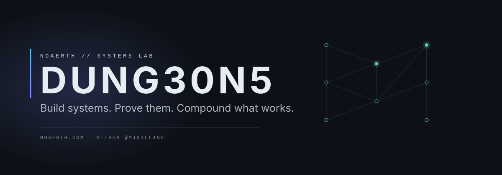
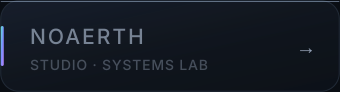
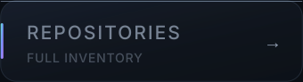
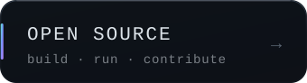
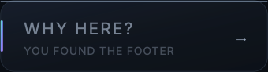
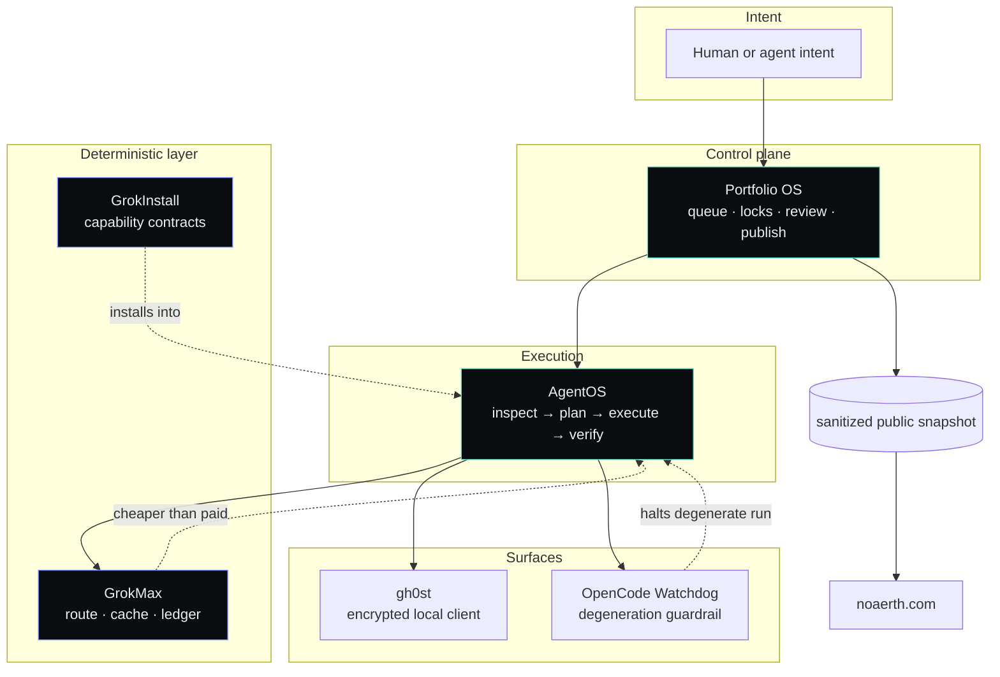

  <picture>
    <source media="(prefers-color-scheme: dark)" srcset="assets/profile/hero-dark.svg">
    <source media="(prefers-color-scheme: light)" srcset="assets/profile/hero-light.svg">
    
  </picture>

  
  
  
  

<h1 align="center">Build systems. Prove them. Compound what works.</h1>

  Autonomous systems &#183; developer infrastructure &#183; research tooling &#183; experimental technology

---

## What I'm building

I build the layer <em>underneath</em> the products: execution engines, control planes,
deterministic tooling and research harnesses that stay honest when the model gets expensive,
slow, or wrong.

Six systems carry most of the weight right now. Each one has tests, an architecture, and a
failure story — that is the bar, not the feature list.

| System | What it actually does |
| --- | --- |
| **[Portfolio OS](https://github.com/M4G3LL4N0/noaerth-portfolio-os)** | Venture-studio control plane. SQLite source of truth, work queue, locks, reviewer separation, allowlist-based public snapshots. |
| **[AgentOS](https://github.com/M4G3LL4N0/agentos)** | Provider-neutral agent execution engine. Objective in, verified outcome out, at the lowest responsible cost. |
| **[GrokInstall](https://github.com/M4G3LL4N0/grokinstall)** | Go CLI that inspects a repository and installs the smallest useful capability into it. "Do not install" is a first-class answer. |
| **[GrokMax](https://github.com/M4G3LL4N0/grokmax)** | Deterministic-first routing. Zero-cost executors before paid ones, a five-layer cache, and telemetry that labels every number measured / estimated / proxy. |
| **[gh0st](https://github.com/M4G3LL4N0/gh0st)** | Local-first encrypted AI client. Your prompts never leave the machine by default. |
| **[OpenCode Watchdog](https://github.com/M4G3LL4N0/opencode-watchdog)** | Circuit breaker for runaway coding-agent sessions. Detects degeneration, aborts the affected session, leaves your files alone. |

Supporting engineering systems live in the [repository list](https://github.com/M4G3LL4N0?tab=repositories). Dedicated project-site repositories are intentionally kept private; the deployed sites remain public where useful.

---

## System map

The rule that holds it together: **no component is allowed to report a number it did not
measure.** Savings are proxies until they are billed. Capability counts come from the ledger,
not from a marketing page.

---

## Current signal

Everything below this line is regenerated from the GitHub API by
`.github/workflows/sync-profile.yml`. Nothing here is hand-maintained, and nothing here is
estimated.

<!-- githubos:start -->
<!-- Generated by Portfolio OS GitHubOS. Do not edit by hand. -->

| | |
| --- | --- |
| Public systems | **9** |
| Tests across public systems | **2,235** |
| Public releases | **10** |

Stars and forks are deliberately not shown. They are not evidence at this scale; the test, CI, and release columns below are.

**Latest releases**

- [M4G3LL4N0/gh0st](https://github.com/M4G3LL4N0/gh0st) **1.0.0-rc.1**
- [M4G3LL4N0/agentos](https://github.com/M4G3LL4N0/agentos) **0.5.0**
- [M4G3LL4N0/grokmax](https://github.com/M4G3LL4N0/grokmax) **0.2.0-rc.2**
- [M4G3LL4N0/grokinstall](https://github.com/M4G3LL4N0/grokinstall) **0.1.1**
- [M4G3LL4N0/grokbot-office](https://github.com/M4G3LL4N0/grokbot-office) **0.1.0**

**Pinned systems**

- [noaerth-portfolio-os](https://github.com/M4G3LL4N0/noaerth-portfolio-os) — Stdlib-only control plane for a portfolio of autonomous agents: SQLite work q… · 203 tests
- [agentos](https://github.com/M4G3LL4N0/agentos) — Provider-neutral AI agent execution and orchestration engine: objective in, v… · 710 tests
- [grokinstall](https://github.com/M4G3LL4N0/grokinstall) — Install the capability, not the complexity. A Go CLI that inspects a repo and… · 486 tests
- [grokmax](https://github.com/M4G3LL4N0/grokmax) — Deterministic-first LLM routing: zero-cost executors first, five-layer cache,… · 287 tests
- [gh0st](https://github.com/M4G3LL4N0/gh0st) — Local-first encrypted AI client for xAI/Grok with verifiable no-retention gua… · 27 tests
- [opencode-watchdog](https://github.com/M4G3LL4N0/opencode-watchdog) — Local circuit breaker for runaway OpenCode sessions. Deterministic detection,… · 70 tests

**Engineering proof**

| System | What it is | Tests | CI | Latest | License |
| --- | --- | --- | --- | --- | --- |
| [agentos](https://github.com/M4G3LL4N0/agentos) | Provider-neutral AI agent execution and orchestration engin… | 710 | yes | v0.5.0 | MIT |
| [gh0st](https://github.com/M4G3LL4N0/gh0st) | Local-first encrypted AI client for xAI/Grok with verifiabl… | 27 | yes | v1.0.0-rc.1 | MIT |
| [grokbot-office](https://github.com/M4G3LL4N0/grokbot-office) | Agent workforce architecture: roles, policy, handoffs and r… | 149 | yes | v0.1.0 | MIT |
| [grokbot-society](https://github.com/M4G3LL4N0/grokbot-society) | Provider-neutral runtime for persistent synthetic people: r… | 157 | yes | v0.1.0 | — |
| [grokinstall](https://github.com/M4G3LL4N0/grokinstall) | Install the capability, not the complexity. A Go CLI that i… | 486 | yes | v0.1.1 | MIT |
| [grokmax](https://github.com/M4G3LL4N0/grokmax) | Deterministic-first LLM routing: zero-cost executors first,… | 287 | yes | v0.2.0-rc.2 | MIT |
| [noaerth-portfolio-os](https://github.com/M4G3LL4N0/noaerth-portfolio-os) | Stdlib-only control plane for a portfolio of autonomous age… | 203 | yes | v0.1.0 | MIT |
| [opencode-watchdog](https://github.com/M4G3LL4N0/opencode-watchdog) | Local circuit breaker for runaway OpenCode sessions. Determ… | 70 | yes | v0.1.0 | MIT |
| [seai-mind](https://github.com/M4G3LL4N0/seai-mind) | Open-source self-evolving AI kernel with an auditable memor… | 146 | yes | v0.1.0-alpha | MIT |

Tests are recorded by an operator after running the suite; CI and releases are read from the GitHub API. A dash means unmeasured, not zero.

Snapshot generated 2026-10-04T22:34:15+00:00 from the GitHub API.
<!-- githubos:end -->

---

## Upstream

<!-- upstream:start -->
<!-- upstream:end -->

---

## Selected labs

<!-- labs:start -->
Nothing published as an experiment yet. A lab earns this section by being
public, honestly labelled `STATUS: EXPERIMENTAL`, and stating what was tested,
what works, and what does not. An unfinished project is not a lab; it is a
draft. See `AGENTS.md` in a repository for the standard.
<!-- labs:end -->

---

## Open source

Public, buildable, and covered by tests.

- **[GrokInstall](https://github.com/M4G3LL4N0/grokinstall)** — `go install` a single binary.
  The deepest documentation in the portfolio and the easiest thing here to actually try.
- **[OpenCode Watchdog](https://github.com/M4G3LL4N0/opencode-watchdog)** — the most
  immediately useful thing to a stranger. Solves a problem every agentic-coding user hits.
- **[GrokMax](https://github.com/M4G3LL4N0/grokmax)** — the cost-control reference
  implementation. Routing, caching, and honest telemetry in one pipeline.
- **[gh0st](https://github.com/M4G3LL4N0/gh0st)** — desktop client with local-first encryption.
- **[AgentOS](https://github.com/M4G3LL4N0/agentos)** — the engine the rest of the stack runs on.
- **[Portfolio OS](https://github.com/M4G3LL4N0/noaerth-portfolio-os)** — the control plane that
  actually manages this portfolio.

Issues, discussions and good-first-issue labels are live on every public repository.

## Contributing

Contributions are welcome on the open-source spearhead first. Read
[CONTRIBUTING.md](CONTRIBUTING.md) — the short version is: branch, keep it reviewable, prove it
with a test, open a PR.

## Security

Report vulnerabilities privately. See [SECURITY.md](SECURITY.md).

## License

Profile content and documentation: [MIT](LICENSE).

---

  
    Some projects reference Grok, ChatGPT, OpenAI and other providers as
    <em>integration targets</em> inside provider-neutral runtimes. Not affiliated with or endorsed by them.  
    Still curious how you got here? <a href="https://github.com/M4G3LL4N0/why-are-you-here">why are you here?</a>
  

