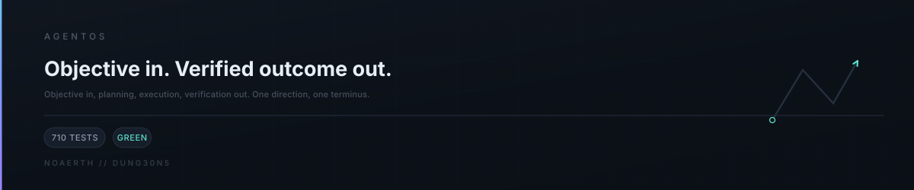
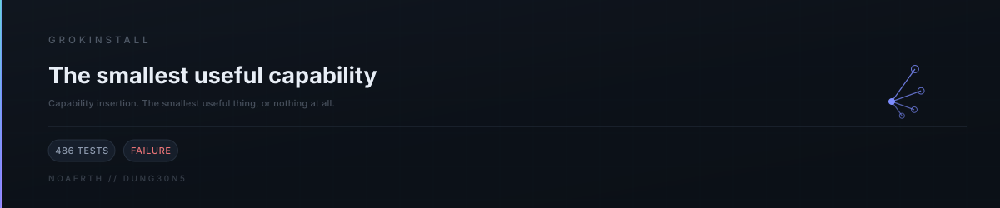
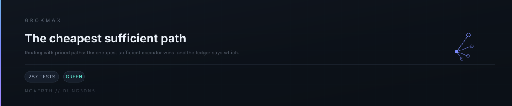
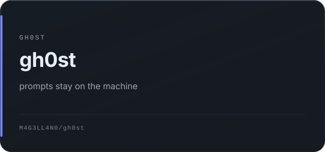
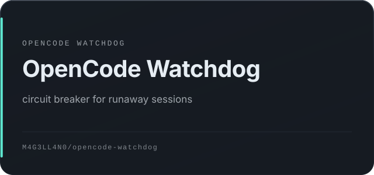
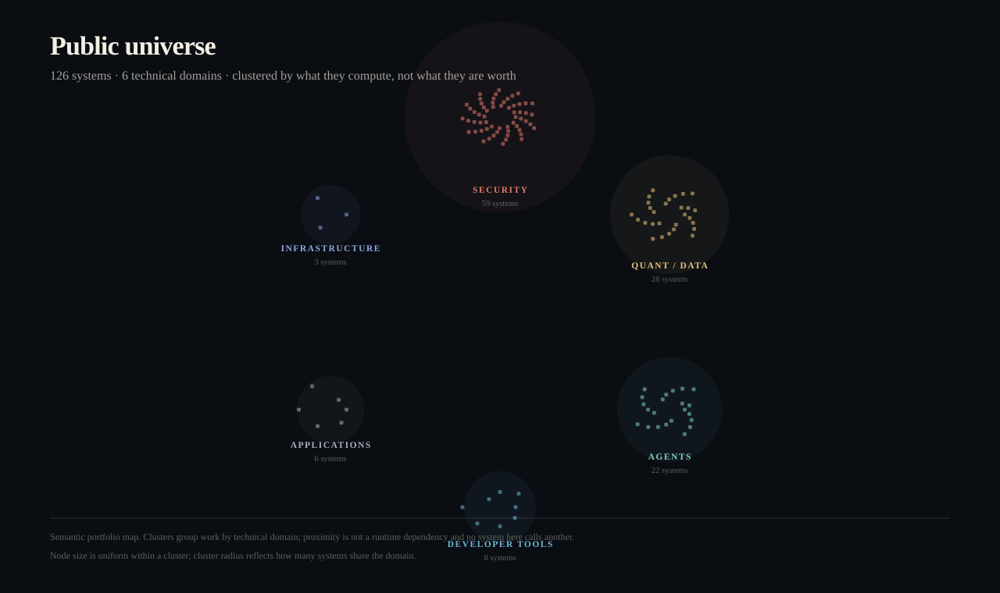

  <picture>
    <source media="(max-width: 560px)" srcset="assets/profile/hero-dark-compact.svg">
    <source media="(prefers-reduced-motion: reduce) and (prefers-color-scheme: light)" srcset="assets/profile/hero-light.svg">
    <source media="(prefers-reduced-motion: reduce)" srcset="assets/profile/hero-dark.svg">
    <source media="(prefers-color-scheme: light)" srcset="assets/profile/hero-light.svg">
    
  </picture>

<a href="https://www.noaerth.com">
    <picture>
      <source media="(prefers-color-scheme: light)" srcset="assets/profile/nav/noaerth-light.svg">
      
    </picture>
  </a>
  <a href="https://github.com/M4G3LL4N0?tab=repositories">
    <picture>
      <source media="(prefers-color-scheme: light)" srcset="assets/profile/nav/repositories-light.svg">
      
    </picture>
  </a>
  <a href="#flagships">
    <picture>
      <source media="(prefers-color-scheme: light)" srcset="assets/profile/nav/repositories-light.svg">
      
    </picture>
  </a>
  <a href="https://github.com/M4G3LL4N0/why-are-you-here">
    <picture>
      <source media="(prefers-color-scheme: light)" srcset="assets/profile/nav/why-light.svg">
      
    </picture>
  </a>

  <strong>Systems builder &#183; hacker &#183; creative technologist</strong> 
  Autonomous systems &#183; developer infrastructure &#183; research tooling &#183; experimental technology

---

## Signal

  <picture>
    <source media="(max-width: 560px)" srcset="assets/profile/build-signal-dark.svg">
    <source media="(prefers-reduced-motion: reduce) and (prefers-color-scheme: light)" srcset="assets/profile/build-signal-light.svg">
    <source media="(prefers-reduced-motion: reduce)" srcset="assets/profile/build-signal-dark.svg">
    <source media="(prefers-color-scheme: light)" srcset="assets/profile/build-signal-light.svg">
    
  </picture>

<!-- signal:start -->
<!-- Generated by scripts/profile_art/render_v7_signal.py from data/v7-signal.json. Do not edit by hand. -->

| Signal | Value | What it counts |
| --- | --- | --- |
| Public repositories | **136** | owned repositories visible on this account |
| Tests verified | **2,032** | test cases run and recorded by an operator |
| CI workflows | **14** | repositories with a test pipeline configured |
| Releases | **6** | tagged GitHub releases |
| READMEs | **136** | public repositories with real documentation |
| SECURITY.md | **136** | repositories with a published security policy |
| Technical domains | **7** | clusters derived from each project's architecture |
| State machines | **15** | distinct computational flows derived from source |

**Technical domains** — AGENTS 9 · APPLICATIONS 62 · CREATIVE COMPUTING 7 · DEVELOPER TOOLS 12 · INFRASTRUCTURE 18 · QUANT / DATA 9 · SECURITY 9  

**Languages** — css 1 · go 1 · html 13 · js 1 · python 2 · sql 1

Measured 2026-10-06T22:00:25Z. Source: reconciled repository inventory, per-project dossiers and operator-recorded test counts. Private and denylisted repositories are excluded from every figure. Stars and forks are deliberately not shown.
<!-- signal:end -->

---

## Flagships

  <a href="https://github.com/M4G3LL4N0/agentos">
    <picture>
      <source media="(prefers-color-scheme: light)" srcset="assets/profile/windows/agentos-light.svg">
      
    </picture>
  </a>

  <a href="https://github.com/M4G3LL4N0/grokinstall">
    <picture>
      <source media="(prefers-color-scheme: light)" srcset="assets/profile/windows/grokinstall-light.svg">
      
    </picture>
  </a>

  <a href="https://github.com/M4G3LL4N0/grokmax">
    <picture>
      <source media="(prefers-color-scheme: light)" srcset="assets/profile/windows/grokmax-light.svg">
      
    </picture>
  </a>

  <a href="https://github.com/M4G3LL4N0/gh0st">
    <picture>
      <source media="(prefers-color-scheme: light)" srcset="assets/profile/windows/gh0st-light.svg">
      
    </picture>
  </a>

  <a href="https://github.com/M4G3LL4N0/opencode-watchdog">
    <picture>
      <source media="(prefers-color-scheme: light)" srcset="assets/profile/windows/opencode-watchdog-light.svg">
      
    </picture>
  </a>

Five public systems carry the weight. Each has an architecture, a test suite,
and a documented failure story. That is the bar, not the feature list.

The control plane that runs this portfolio is deliberately not public.

---

## Architecture

  <picture>
    <source media="(max-width: 560px)" srcset="assets/profile/system-map-dark-compact.svg">
    <source media="(prefers-reduced-motion: reduce) and (prefers-color-scheme: light)" srcset="assets/profile/system-map-light.svg">
    <source media="(prefers-reduced-motion: reduce)" srcset="assets/profile/system-map-dark.svg">
    <source media="(prefers-color-scheme: light)" srcset="assets/profile/system-map-light.svg">
    
  </picture>

Five layers. **Control architecture** decides what runs and who approved it.
The **execution machine** turns an objective into a verified outcome. **Economy
and routing** keeps that outcome cheap. **Guardrails** stop degenerate work
before it costs anything. **Surfaces** are where the work becomes usable.

A relationship is printed only where one repository's source or documentation
names the other. Three exist. Most systems deliberately show no relationship at
all, because none is documented — and several systems whose relationships are explicitly *not* dependencies.

  

<strong>Full engineering proof</strong> — every public system, measured

<!-- githubos:start -->
<!-- Generated by Portfolio OS GitHubOS. Do not edit by hand. -->

| | |
| --- | --- |
| Public systems | **8** |
| Tests across public systems | **2,032** |
| Public releases | **9** |

Stars and forks are deliberately not shown. They are not evidence at this scale; the test, CI, and release columns below are.

**Latest releases**

- [M4G3LL4N0/gh0st](https://github.com/M4G3LL4N0/gh0st) **1.0.0-rc.1**
- [M4G3LL4N0/agentos](https://github.com/M4G3LL4N0/agentos) **0.5.0**
- [M4G3LL4N0/grokmax](https://github.com/M4G3LL4N0/grokmax) **0.2.0-rc.2**
- [M4G3LL4N0/grokinstall](https://github.com/M4G3LL4N0/grokinstall) **0.1.1**
- [M4G3LL4N0/grokbot-office](https://github.com/M4G3LL4N0/grokbot-office) **0.1.0**

**Pinned systems**

- [agentos](https://github.com/M4G3LL4N0/agentos) — Provider-neutral AI agent execution and orchestration engine: objective in, v… · 710 tests
- [grokinstall](https://github.com/M4G3LL4N0/grokinstall) — Install the capability, not the complexity. A Go CLI that inspects a repo and… · 486 tests
- [grokmax](https://github.com/M4G3LL4N0/grokmax) — Deterministic-first LLM routing: zero-cost executors first, five-layer cache,… · 287 tests
- [gh0st](https://github.com/M4G3LL4N0/gh0st) — Local-first encrypted AI client for xAI/Grok with verifiable no-retention gua… · 27 tests
- [opencode-watchdog](https://github.com/M4G3LL4N0/opencode-watchdog) — Local circuit breaker for runaway OpenCode sessions. Deterministic detection,… · 70 tests

| System | What it is | Tests | CI | Latest | License |
| --- | --- | --- | --- | --- | --- |
| [agentos](https://github.com/M4G3LL4N0/agentos) | Provider-neutral AI agent execution and orchestration engin… | 710 | green | v0.5.0 | MIT |
| [gh0st](https://github.com/M4G3LL4N0/gh0st) | Local-first encrypted AI client for xAI/Grok with verifiabl… | 27 | failure | v1.0.0-rc.1 | MIT |
| [grokbot-office](https://github.com/M4G3LL4N0/grokbot-office) | Agent workforce architecture: roles, policy, handoffs and r… | 149 | green | v0.1.0 | MIT |
| [grokbot-society](https://github.com/M4G3LL4N0/grokbot-society) | Provider-neutral runtime for persistent synthetic people: r… | 157 | green | v0.1.0 | — |
| [grokinstall](https://github.com/M4G3LL4N0/grokinstall) | Install the capability, not the complexity. A Go CLI that i… | 486 | failure | v0.1.1 | MIT |
| [grokmax](https://github.com/M4G3LL4N0/grokmax) | Deterministic-first LLM routing: zero-cost executors first,… | 287 | green | v0.2.0-rc.2 | MIT |
| [opencode-watchdog](https://github.com/M4G3LL4N0/opencode-watchdog) | Local circuit breaker for runaway OpenCode sessions. Determ… | 70 | green | v0.1.0 | MIT |
| [seai-mind](https://github.com/M4G3LL4N0/seai-mind) | Open-source self-evolving AI kernel with an auditable memor… | 146 | failure | v0.1.0-alpha | MIT |

Tests are recorded by an operator after running the suite; CI and releases are read from the GitHub API. A dash means unmeasured, not zero.

Snapshot generated 2026-10-05T22:12:57+00:00 from the GitHub API.
<!-- githubos:end -->

<!-- upstream:start -->
<!-- No upstream section is rendered: 0 pull requests have been merged into repositories this account does not own. Regenerate with render_upstream_block.py once that changes. -->
<!-- upstream:end -->

---

## Public universe

  <picture>
    <source media="(prefers-reduced-motion: reduce)" srcset="assets/profile/public-universe-dark.svg">
    <source media="(prefers-color-scheme: light)" srcset="assets/profile/public-universe-light.svg">
    
  </picture>

Every public system is placed by the architecture read from its own source. The
clusters are **categories of work**, not a dependency graph: no system here
calls another, and the plate says so.

---

## Systems

| | |
| --- | --- |
| Agent systems | objective → routing → worker → verification |
| Security | request → boundary → policy → decision → containment |
| Infrastructure | service → route → resource → health |
| Developer tools | input → analysis → transformation → output |
| Data and quant | ingest → normalise → index → query → audit |
| Creative computing | layers → transformation → composition |

Each project's own hero animates that project's flow rather than a shared
template. 18 distinct state machines are derived from source across 126
systems.

---

<!-- labs:start -->
Nothing here has earned the label yet. A lab has to be public, honestly marked
`STATUS: EXPERIMENTAL`, and explicit about what was tested, what works, and what
does not. An unfinished project is a draft, not a lab.
<!-- labs:end -->

---

## Working on this

Contributions are welcome on the open-source spearhead first: branch, keep it
reviewable, prove it with a test, open a PR. See [CONTRIBUTING.md](CONTRIBUTING.md).
Vulnerabilities go through [SECURITY.md](SECURITY.md) privately. Documentation and
profile content are [MIT](LICENSE).

---

  <picture>
    <source media="(max-width: 560px)" srcset="assets/profile/terminal-dark.svg">
    <source media="(prefers-reduced-motion: reduce) and (prefers-color-scheme: light)" srcset="assets/profile/terminal-light.svg">
    <source media="(prefers-reduced-motion: reduce)" srcset="assets/profile/terminal-dark.svg">
    <source media="(prefers-color-scheme: light)" srcset="assets/profile/terminal-light.svg">
    
  </picture>

  
    Some projects reference Grok, ChatGPT, OpenAI, OpenCode and other providers as
    <em>integration targets</em> inside provider-neutral runtimes. Not affiliated
    with, endorsed by, or maintained by them.
  

