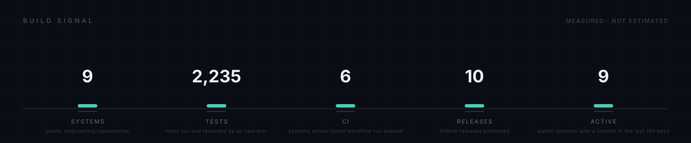
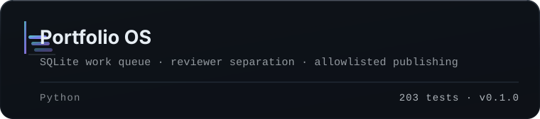
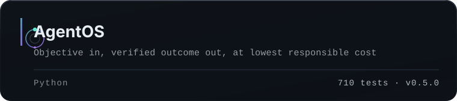
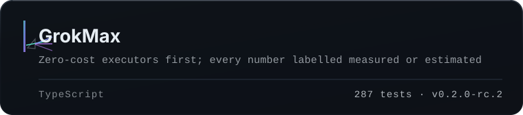
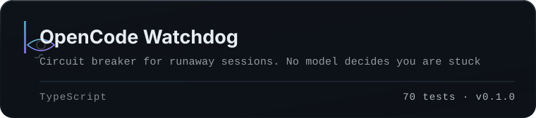
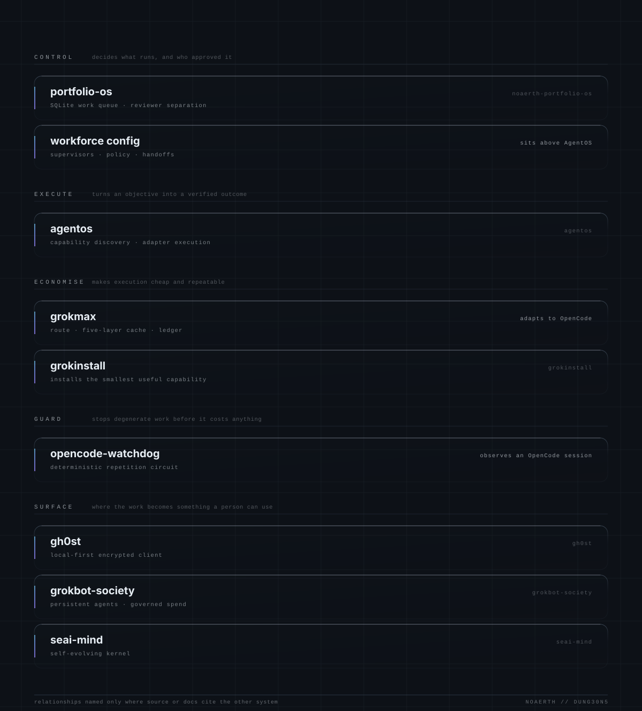

  <picture>
    <source media="(max-width: 560px)" srcset="assets/profile/hero-dark-compact.svg">
    <source media="(prefers-reduced-motion: reduce) and (prefers-color-scheme: light)" srcset="assets/profile/hero-light.svg">
    <source media="(prefers-reduced-motion: reduce)" srcset="assets/profile/hero-dark.svg">
    <source media="(prefers-color-scheme: light)" srcset="assets/profile/hero-light.svg">
    
  </picture>

  <a href="https://www.noaerth.com">
    <picture>
      <source media="(prefers-color-scheme: light)" srcset="assets/profile/nav/noaerth-light.svg">
      
    </picture>
  </a>
  <a href="https://github.com/M4G3LL4N0?tab=repositories">
    <picture>
      <source media="(prefers-color-scheme: light)" srcset="assets/profile/nav/repositories-light.svg">
      
    </picture>
  </a>
  <a href="#flagships">
    <picture>
      <source media="(prefers-color-scheme: light)" srcset="assets/profile/nav/open-source-light.svg">
      
    </picture>
  </a>
  <a href="https://github.com/M4G3LL4N0/why-are-you-here">
    <picture>
      <source media="(prefers-color-scheme: light)" srcset="assets/profile/nav/why-light.svg">
      
    </picture>
  </a>

  <strong>Systems builder &#183; hacker &#183; creative technologist</strong> 
  Autonomous systems &#183; developer infrastructure &#183; research tooling &#183; experimental technology

---

## Build signal

  <picture>
    <source media="(prefers-color-scheme: light)" srcset="assets/profile/build-signal-light.svg">
    
  </picture>

<!-- signal:start -->
<!-- Generated by scripts/profile_art/render_signal_block.py from
     assets/profile/build-signal.json. Do not edit by hand. -->

| Metric | Value | What it counts |
| --- | --- | --- |
| Systems | **9** | public engineering repositories |
| Tests | **2,235** | tests run and recorded by an operator |
| CI | **6** | systems whose latest workflow run passed |
| Releases | **10** | GitHub releases published |
| Active | **9** | public systems with a commit in the last 180 days |

Measured 2026-10-04T23:33:30+00:00. Source: enriched repos.json snapshot + tests.json (operator-recorded test counts). Stars and forks are deliberately absent: at this scale they are not evidence.
<!-- signal:end -->

---

## Flagships

  <a href="https://github.com/M4G3LL4N0/noaerth-portfolio-os">
    <picture>
      <source media="(prefers-color-scheme: light)" srcset="assets/profile/cards/noaerth-portfolio-os-light.svg">
      
    </picture>
  </a>

  <a href="https://github.com/M4G3LL4N0/agentos">
    <picture>
      <source media="(prefers-color-scheme: light)" srcset="assets/profile/cards/agentos-light.svg">
      
    </picture>
  </a>

  <a href="https://github.com/M4G3LL4N0/grokinstall">
    <picture>
      <source media="(prefers-color-scheme: light)" srcset="assets/profile/cards/grokinstall-light.svg">
      
    </picture>
  </a>

  <a href="https://github.com/M4G3LL4N0/grokmax">
    <picture>
      <source media="(prefers-color-scheme: light)" srcset="assets/profile/cards/grokmax-light.svg">
      
    </picture>
  </a>

  <a href="https://github.com/M4G3LL4N0/gh0st">
    <picture>
      <source media="(prefers-color-scheme: light)" srcset="assets/profile/cards/gh0st-light.svg">
      
    </picture>
  </a>

  <a href="https://github.com/M4G3LL4N0/opencode-watchdog">
    <picture>
      <source media="(prefers-color-scheme: light)" srcset="assets/profile/cards/opencode-watchdog-light.svg">
      
    </picture>
  </a>

Each of these has an architecture, a test suite, and a documented failure story.
That is the bar, not the feature list. Everything else lives in the
[repository list](https://github.com/M4G3LL4N0?tab=repositories).

---

## Operating stack

  <picture>
    <source media="(max-width: 560px)" srcset="assets/profile/system-map-dark-compact.svg">
    <source media="(prefers-color-scheme: light)" srcset="assets/profile/system-map-light.svg">
    
  </picture>

Five layers. **Control** decides what runs and who approved it. **Execution**
turns an objective into a verified outcome. **Economy** keeps that outcome cheap
and repeatable. **Guardrails** stop degenerate work before it costs anything.
**Surfaces** are where the work becomes something a person can use.

A relationship is printed on the plate only where one repository's source or
documentation names the other. Three exist. Most systems deliberately have no
drawn relationship at all, because none is documented.

The rule that holds it together: **no component reports a number it did not
measure.** Savings are proxies until they are billed. Capability counts come from
the ledger, test counts from a suite an operator actually ran.

<strong>Full engineering proof</strong> — every public system, measured

<!-- githubos:start -->
<!-- Generated by Portfolio OS GitHubOS. Do not edit by hand. -->

| | |
| --- | --- |
| Public systems | **9** |
| Tests across public systems | **2,235** |
| Public releases | **10** |

Stars and forks are deliberately not shown. They are not evidence at this scale; the test, CI, and release columns below are.

**Latest releases**

- [M4G3LL4N0/gh0st](https://github.com/M4G3LL4N0/gh0st) **1.0.0-rc.1**
- [M4G3LL4N0/agentos](https://github.com/M4G3LL4N0/agentos) **0.5.0**
- [M4G3LL4N0/grokmax](https://github.com/M4G3LL4N0/grokmax) **0.2.0-rc.2**
- [M4G3LL4N0/grokinstall](https://github.com/M4G3LL4N0/grokinstall) **0.1.1**
- [M4G3LL4N0/grokbot-office](https://github.com/M4G3LL4N0/grokbot-office) **0.1.0**

**Pinned systems**

- [noaerth-portfolio-os](https://github.com/M4G3LL4N0/noaerth-portfolio-os) — Stdlib-only control plane for a portfolio of autonomous agents: SQLite work q… · 203 tests
- [agentos](https://github.com/M4G3LL4N0/agentos) — Provider-neutral AI agent execution and orchestration engine: objective in, v… · 710 tests
- [grokinstall](https://github.com/M4G3LL4N0/grokinstall) — Install the capability, not the complexity. A Go CLI that inspects a repo and… · 486 tests
- [grokmax](https://github.com/M4G3LL4N0/grokmax) — Deterministic-first LLM routing: zero-cost executors first, five-layer cache,… · 287 tests
- [gh0st](https://github.com/M4G3LL4N0/gh0st) — Local-first encrypted AI client for xAI/Grok with verifiable no-retention gua… · 27 tests
- [opencode-watchdog](https://github.com/M4G3LL4N0/opencode-watchdog) — Local circuit breaker for runaway OpenCode sessions. Deterministic detection,… · 70 tests

**Engineering proof**

| System | What it is | Tests | CI | Latest | License |
| --- | --- | --- | --- | --- | --- |
| [agentos](https://github.com/M4G3LL4N0/agentos) | Provider-neutral AI agent execution and orchestration engin… | 710 | yes | v0.5.0 | MIT |
| [gh0st](https://github.com/M4G3LL4N0/gh0st) | Local-first encrypted AI client for xAI/Grok with verifiabl… | 27 | yes | v1.0.0-rc.1 | MIT |
| [grokbot-office](https://github.com/M4G3LL4N0/grokbot-office) | Agent workforce architecture: roles, policy, handoffs and r… | 149 | yes | v0.1.0 | MIT |
| [grokbot-society](https://github.com/M4G3LL4N0/grokbot-society) | Provider-neutral runtime for persistent synthetic people: r… | 157 | yes | v0.1.0 | — |
| [grokinstall](https://github.com/M4G3LL4N0/grokinstall) | Install the capability, not the complexity. A Go CLI that i… | 486 | yes | v0.1.1 | MIT |
| [grokmax](https://github.com/M4G3LL4N0/grokmax) | Deterministic-first LLM routing: zero-cost executors first,… | 287 | yes | v0.2.0-rc.2 | MIT |
| [noaerth-portfolio-os](https://github.com/M4G3LL4N0/noaerth-portfolio-os) | Stdlib-only control plane for a portfolio of autonomous age… | 203 | yes | v0.1.0 | MIT |
| [opencode-watchdog](https://github.com/M4G3LL4N0/opencode-watchdog) | Local circuit breaker for runaway OpenCode sessions. Determ… | 70 | yes | v0.1.0 | MIT |
| [seai-mind](https://github.com/M4G3LL4N0/seai-mind) | Open-source self-evolving AI kernel with an auditable memor… | 146 | yes | v0.1.0-alpha | MIT |

Tests are recorded by an operator after running the suite; CI and releases are read from the GitHub API. A dash means unmeasured, not zero.

Snapshot generated 2026-10-04T22:34:15+00:00 from the GitHub API.
<!-- githubos:end -->

<!-- upstream:start -->
<!-- No upstream section is rendered: 0 pull requests have been merged into repositories this account does not own. Regenerate with render_upstream_block.py once that changes. -->
<!-- upstream:end -->

---

## Selected labs

<!-- labs:start -->
Nothing here has earned the label yet. A lab has to be public, honestly marked
`STATUS: EXPERIMENTAL`, and explicit about what was tested, what works, and what
does not. An unfinished project is a draft, not a lab.
<!-- labs:end -->

---

## Working on this

Contributions are welcome on the open-source spearhead first: branch, keep it
reviewable, prove it with a test, open a PR. See [CONTRIBUTING.md](CONTRIBUTING.md).
Vulnerabilities go through [SECURITY.md](SECURITY.md) privately. Documentation and
profile content are [MIT](LICENSE).

---

  <a href="https://github.com/M4G3LL4N0/why-are-you-here">
    <picture>
      <source media="(prefers-reduced-motion: reduce) and (prefers-color-scheme: light)" srcset="assets/profile/terminal-light.svg">
      <source media="(prefers-reduced-motion: reduce)" srcset="assets/profile/terminal-dark.svg">
      <source media="(prefers-color-scheme: light)" srcset="assets/profile/terminal-light.svg">
      
    </picture>
  </a>

  
    Some projects reference Grok, ChatGPT, OpenAI, OpenCode and other providers as
    <em>integration targets</em> inside provider-neutral runtimes. Not affiliated
    with, endorsed by, or maintained by them.
  

