# DUNG30N5 × NOAERTH

  <picture>
    <source media="(prefers-reduced-motion: reduce)" srcset="assets/hero/hero-reduced.svg">
    <source media="(prefers-color-scheme: light)" srcset="assets/hero/hero-light.svg">
    
  </picture>

**136 repositories** • **12 categories** • **1360 animated SVGs** • **2,032 tests** • **14 CI workflows** • **6 releases** • **136 READMEs** • **136 SECURITY.md** • **136 animated heroes** • **136 static dark/light/reduced fallbacks**

---

## 🧠 AGENT SYSTEMS (10)

## 🛠️ Developer Tools (32)

### [1bc](https://github.com/M4G3LL4N0/1bc)

  <picture>
    <source media="(prefers-reduced-motion: reduce)" srcset="https://raw.githubusercontent.com/M4G3LL4N0/1bc/main/assets/hero/hero-reduced.svg">
    <source media="(prefers-color-scheme: light)" srcset="https://raw.githubusercontent.com/M4G3LL4N0/1bc/main/assets/hero/hero-light.svg">
    
  </picture>

1BC: a developer tool, built on TypeScript.

`developer-tooling` `typescript` `developer-tools` `dung30n5` `noaerth`

---

### [Bourgaeux](https://github.com/M4G3LL4N0/Bourgaeux)

  <picture>
    <source media="(prefers-reduced-motion: reduce)" srcset="https://raw.githubusercontent.com/M4G3LL4N0/Bourgaeux/main/assets/hero/hero-reduced.svg">
    <source media="(prefers-color-scheme: light)" srcset="https://raw.githubusercontent.com/M4G3LL4N0/Bourgaeux/main/assets/hero/hero-light.svg">
    
  </picture>

Bourgaeux: a developer tool, built on TypeScript.

`developer-tooling` `typescript` `developer-tools` `dung30n5` `noaerth`

---

### [ai-dev-workflow-starter](https://github.com/M4G3LL4N0/ai-dev-workflow-starter)

  <picture>
    <source media="(prefers-reduced-motion: reduce)" srcset="https://raw.githubusercontent.com/M4G3LL4N0/ai-dev-workflow-starter/main/assets/hero/hero-reduced.svg">
    <source media="(prefers-color-scheme: light)" srcset="https://raw.githubusercontent.com/M4G3LL4N0/ai-dev-workflow-starter/main/assets/hero/hero-light.svg">
    
  </picture>

Ai Dev Workflow Starter: a developer tool, built on Shell.

`developer-tooling` `shell` `developer-tools` `dung30n5` `noaerth`

---

### [blitzunicorn](https://github.com/M4G3LL4N0/blitzunicorn)

  <picture>
    <source media="(prefers-reduced-motion: reduce)" srcset="https://raw.githubusercontent.com/M4G3LL4N0/blitzunicorn/main/assets/hero/hero-reduced.svg">
    <source media="(prefers-color-scheme: light)" srcset="https://raw.githubusercontent.com/M4G3LL4N0/blitzunicorn/main/assets/hero/hero-light.svg">
    
  </picture>

BlitzUnicorn: a developer tool, built on TypeScript.

`developer-tooling` `typescript` `developer-tools` `dung30n5` `noaerth`

---

### [buildloop-usa](https://github.com/M4G3LL4N0/buildloop-usa)

  <picture>
    <source media="(prefers-reduced-motion: reduce)" srcset="https://raw.githubusercontent.com/M4G3LL4N0/buildloop-usa/main/assets/hero/hero-reduced.svg">
    <source media="(prefers-color-scheme: light)" srcset="https://raw.githubusercontent.com/M4G3LL4N0/buildloop-usa/main/assets/hero/hero-light.svg">
    
  </picture>

BuildLoop USA: a developer tool, built on TypeScript.

`developer-tooling` `typescript` `developer-tools` `dung30n5` `noaerth`

---

### [childdevos](https://github.com/M4G3LL4N0/childdevos)

  <picture>
    <source media="(prefers-reduced-motion: reduce)" srcset="https://raw.githubusercontent.com/M4G3LL4N0/childdevos/main/assets/hero/hero-reduced.svg">
    <source media="(prefers-color-scheme: light)" srcset="https://raw.githubusercontent.com/M4G3LL4N0/childdevos/main/assets/hero/hero-light.svg">
    
  </picture>

ChildDevOS: a developer tool, structured around policy.

`developer-tooling` `typescript` `developer-tools` `dung30n5` `noaerth`

---

### [chipflow](https://github.com/M4G3LL4N0/chipflow)

  <picture>
    <source media="(prefers-reduced-motion: reduce)" srcset="https://raw.githubusercontent.com/M4G3LL4N0/chipflow/main/assets/hero/hero-reduced.svg">
    <source media="(prefers-color-scheme: light)" srcset="https://raw.githubusercontent.com/M4G3LL4N0/chipflow/main/assets/hero/hero-light.svg">
    
  </picture>

ChipFlow: a developer tool, built on TypeScript.

`developer-tooling` `typescript` `developer-tools` `dung30n5` `noaerth`

---

### [cleanstack-macos](https://github.com/M4G3LL4N0/cleanstack-macos)

  <picture>
    <source media="(prefers-reduced-motion: reduce)" srcset="https://raw.githubusercontent.com/M4G3LL4N0/cleanstack-macos/main/assets/hero/hero-reduced.svg">
    <source media="(prefers-color-scheme: light)" srcset="https://raw.githubusercontent.com/M4G3LL4N0/cleanstack-macos/main/assets/hero/hero-light.svg">
    
  </picture>

cleanstack-macos: a developer tool, built on Swift.

`developer-tooling` `swift` `developer-tools` `dung30n5` `noaerth`

---

### [cleanstack-os](https://github.com/M4G3LL4N0/cleanstack-os)

  <picture>
    <source media="(prefers-reduced-motion: reduce)" srcset="https://raw.githubusercontent.com/M4G3LL4N0/cleanstack-os/main/assets/hero/hero-reduced.svg">
    <source media="(prefers-color-scheme: light)" srcset="https://raw.githubusercontent.com/M4G3LL4N0/cleanstack-os/main/assets/hero/hero-light.svg">
    
  </picture>

cleanstack-os: a developer tool, structured around cache.

`developer-tooling` `typescript` `developer-tools` `dung30n5` `noaerth`

---

### [computeflow-website](https://github.com/M4G3LL4N0/computeflow-website)

  <picture>
    <source media="(prefers-reduced-motion: reduce)" srcset="https://raw.githubusercontent.com/M4G3LL4N0/computeflow-website/main/assets/hero/hero-reduced.svg">
    <source media="(prefers-color-scheme: light)" srcset="https://raw.githubusercontent.com/M4G3LL4N0/computeflow-website/main/assets/hero/hero-light.svg">
    
  </picture>

computeflow-website: a developer tool, structured around benchmark.

`developer-tooling` `developer-tools` `dung30n5` `noaerth`

---

### [deploylocal-website](https://github.com/M4G3LL4N0/deploylocal-website)

  <picture>
    <source media="(prefers-reduced-motion: reduce)" srcset="https://raw.githubusercontent.com/M4G3LL4N0/deploylocal-website/main/assets/hero/hero-reduced.svg">
    <source media="(prefers-color-scheme: light)" srcset="https://raw.githubusercontent.com/M4G3LL4N0/deploylocal-website/main/assets/hero/hero-light.svg">
    
  </picture>

deploylocal-website: a developer tool, organised as a modular system.

`developer-tooling` `developer-tools` `dung30n5` `noaerth`

---

### [devstate](https://github.com/M4G3LL4N0/devstate)

  <picture>
    <source media="(prefers-reduced-motion: reduce)" srcset="https://raw.githubusercontent.com/M4G3LL4N0/devstate/main/assets/hero/hero-reduced.svg">
    <source media="(prefers-color-scheme: light)" srcset="https://raw.githubusercontent.com/M4G3LL4N0/devstate/main/assets/hero/hero-light.svg">
    
  </picture>

DevState: a developer tool, structured around terminal.

`developer-tooling` `typescript` `developer-tools` `dung30n5` `noaerth`

---

### [devstate-website](https://github.com/M4G3LL4N0/devstate-website)

  <picture>
    <source media="(prefers-reduced-motion: reduce)" srcset="https://raw.githubusercontent.com/M4G3LL4N0/devstate-website/main/assets/hero/hero-reduced.svg">
    <source media="(prefers-color-scheme: light)" srcset="https://raw.githubusercontent.com/M4G3LL4N0/devstate-website/main/assets/hero/hero-light.svg">
    
  </picture>

devstate-website: a developer tool, organised as a modular system.

`developer-tooling` `developer-tools` `dung30n5` `noaerth`

---

### [forgeflow](https://github.com/M4G3LL4N0/forgeflow)

  <picture>
    <source media="(prefers-reduced-motion: reduce)" srcset="https://raw.githubusercontent.com/M4G3LL4N0/forgeflow/main/assets/hero/hero-reduced.svg">
    <source media="(prefers-color-scheme: light)" srcset="https://raw.githubusercontent.com/M4G3LL4N0/forgeflow/main/assets/hero/hero-light.svg">
    
  </picture>

ForgeFlow: a developer tool, built on TypeScript.

`developer-tooling` `typescript` `developer-tools` `dung30n5` `noaerth`

---

### [fullofshit](https://github.com/M4G3LL4N0/fullofshit)

  <picture>
    <source media="(prefers-reduced-motion: reduce)" srcset="https://raw.githubusercontent.com/M4G3LL4N0/fullofshit/main/assets/hero/hero-reduced.svg">
    <source media="(prefers-color-scheme: light)" srcset="https://raw.githubusercontent.com/M4G3LL4N0/fullofshit/main/assets/hero/hero-light.svg">
    
  </picture>

FullOfShit: a developer tool, structured around stack.

`developer-tooling` `typescript` `developer-tools` `dung30n5` `noaerth`

---

### [grokbot-office](https://github.com/M4G3LL4N0/grokbot-office)

  <picture>
    <source media="(prefers-reduced-motion: reduce)" srcset="https://raw.githubusercontent.com/M4G3LL4N0/grokbot-office/main/assets/hero/hero-reduced.svg">
    <source media="(prefers-color-scheme: light)" srcset="https://raw.githubusercontent.com/M4G3LL4N0/grokbot-office/main/assets/hero/hero-light.svg">
    
  </picture>

GrokBot Office: a developer tool, structured around stack.

`developer-tooling` `typescript` `developer-tools` `dung30n5` `noaerth`

---

### [grokmax](https://github.com/M4G3LL4N0/grokmax)

  <picture>
    <source media="(prefers-reduced-motion: reduce)" srcset="https://raw.githubusercontent.com/M4G3LL4N0/grokmax/main/assets/hero/hero-reduced.svg">
    <source media="(prefers-color-scheme: light)" srcset="https://raw.githubusercontent.com/M4G3LL4N0/grokmax/main/assets/hero/hero-light.svg">
    
  </picture>

GrokMax: a developer tool, structured around cache.

`developer-tooling` `typescript` `developer-tools` `dung30n5` `noaerth`

---

### [morphui](https://github.com/M4G3LL4N0/morphui)

  <picture>
    <source media="(prefers-reduced-motion: reduce)" srcset="https://raw.githubusercontent.com/M4G3LL4N0/morphui/main/assets/hero/hero-reduced.svg">
    <source media="(prefers-color-scheme: light)" srcset="https://raw.githubusercontent.com/M4G3LL4N0/morphui/main/assets/hero/hero-light.svg">
    
  </picture>

MorphUI: a developer tool, structured around pipeline.

`developer-tooling` `typescript` `developer-tools` `dung30n5` `noaerth`

---

### [obviouslybad](https://github.com/M4G3LL4N0/obviouslybad)

  <picture>
    <source media="(prefers-reduced-motion: reduce)" srcset="https://raw.githubusercontent.com/M4G3LL4N0/obviouslybad/main/assets/hero/hero-reduced.svg">
    <source media="(prefers-color-scheme: light)" srcset="https://raw.githubusercontent.com/M4G3LL4N0/obviouslybad/main/assets/hero/hero-light.svg">
    
  </picture>

ObviouslyBad: a developer tool, structured around stack.

`developer-tooling` `typescript` `developer-tools` `dung30n5` `noaerth`

---

### [oodax](https://github.com/M4G3LL4N0/oodax)

  <picture>
    <source media="(prefers-reduced-motion: reduce)" srcset="https://raw.githubusercontent.com/M4G3LL4N0/oodax/main/assets/hero/hero-reduced.svg">
    <source media="(prefers-color-scheme: light)" srcset="https://raw.githubusercontent.com/M4G3LL4N0/oodax/main/assets/hero/hero-light.svg">
    
  </picture>

Oodax: a developer tool, built on TypeScript.

`developer-tooling` `typescript` `developer-tools` `dung30n5` `noaerth`

---

### [opencode-watchdog-website](https://github.com/M4G3LL4N0/opencode-watchdog-website)

  <picture>
    <source media="(prefers-reduced-motion: reduce)" srcset="https://raw.githubusercontent.com/M4G3LL4N0/opencode-watchdog-website/main/assets/hero/hero-reduced.svg">
    <source media="(prefers-color-scheme: light)" srcset="https://raw.githubusercontent.com/M4G3LL4N0/opencode-watchdog-website/main/assets/hero/hero-light.svg">
    
  </picture>

opencode-watchdog-website: a developer tool, built on TypeScript.

`developer-tooling` `typescript` `developer-tools` `dung30n5` `noaerth`

---

### [psychemap](https://github.com/M4G3LL4N0/psychemap)

  <picture>
    <source media="(prefers-reduced-motion: reduce)" srcset="https://raw.githubusercontent.com/M4G3LL4N0/psychemap/main/assets/hero/hero-reduced.svg">
    <source media="(prefers-color-scheme: light)" srcset="https://raw.githubusercontent.com/M4G3LL4N0/psychemap/main/assets/hero/hero-light.svg">
    
  </picture>

psychemap: a developer tool, built on TypeScript.

`developer-tooling` `typescript` `developer-tools` `dung30n5` `noaerth`

---

### [readablestack](https://github.com/M4G3LL4N0/readablestack)

  <picture>
    <source media="(prefers-reduced-motion: reduce)" srcset="https://raw.githubusercontent.com/M4G3LL4N0/readablestack/main/assets/hero/hero-reduced.svg">
    <source media="(prefers-color-scheme: light)" srcset="https://raw.githubusercontent.com/M4G3LL4N0/readablestack/main/assets/hero/hero-light.svg">
    
  </picture>

ReadableStack: a developer tool, built on TypeScript.

`developer-tooling` `typescript` `developer-tools` `dung30n5` `noaerth`

---

### [reviewforge-ai](https://github.com/M4G3LL4N0/reviewforge-ai)

  <picture>
    <source media="(prefers-reduced-motion: reduce)" srcset="https://raw.githubusercontent.com/M4G3LL4N0/reviewforge-ai/main/assets/hero/hero-reduced.svg">
    <source media="(prefers-color-scheme: light)" srcset="https://raw.githubusercontent.com/M4G3LL4N0/reviewforge-ai/main/assets/hero/hero-light.svg">
    
  </picture>

ReviewForge AI: a developer tool, structured around stack.

`developer-tooling` `typescript` `developer-tools` `dung30n5` `noaerth`

---

### [siliconcontrol-tower](https://github.com/M4G3LL4N0/siliconcontrol-tower)

  <picture>
    <source media="(prefers-reduced-motion: reduce)" srcset="https://raw.githubusercontent.com/M4G3LL4N0/siliconcontrol-tower/main/assets/hero/hero-reduced.svg">
    <source media="(prefers-color-scheme: light)" srcset="https://raw.githubusercontent.com/M4G3LL4N0/siliconcontrol-tower/main/assets/hero/hero-light.svg">
    
  </picture>

SiliconControl Tower: a developer tool, built on TypeScript.

`developer-tooling` `typescript` `developer-tools` `dung30n5` `noaerth`

---

### [strxngth](https://github.com/M4G3LL4N0/strxngth)

  <picture>
    <source media="(prefers-reduced-motion: reduce)" srcset="https://raw.githubusercontent.com/M4G3LL4N0/strxngth/main/assets/hero/hero-reduced.svg">
    <source media="(prefers-color-scheme: light)" srcset="https://raw.githubusercontent.com/M4G3LL4N0/strxngth/main/assets/hero/hero-light.svg">
    
  </picture>

STRxNGTH: a developer tool, structured around ast.

`developer-tooling` `typescript` `developer-tools` `dung30n5` `noaerth`

---

### [trajectoryos](https://github.com/M4G3LL4N0/trajectoryos)

  <picture>
    <source media="(prefers-reduced-motion: reduce)" srcset="https://raw.githubusercontent.com/M4G3LL4N0/trajectoryos/main/assets/hero/hero-reduced.svg">
    <source media="(prefers-color-scheme: light)" srcset="https://raw.githubusercontent.com/M4G3LL4N0/trajectoryos/main/assets/hero/hero-light.svg">
    
  </picture>

TrajectoryOS: a developer tool, built on TypeScript.

`developer-tooling` `typescript` `developer-tools` `dung30n5` `noaerth`

---

### [useros](https://github.com/M4G3LL4N0/useros)

  <picture>
    <source media="(prefers-reduced-motion: reduce)" srcset="https://raw.githubusercontent.com/M4G3LL4N0/useros/main/assets/hero/hero-reduced.svg">
    <source media="(prefers-color-scheme: light)" srcset="https://raw.githubusercontent.com/M4G3LL4N0/useros/main/assets/hero/hero-light.svg">
    
  </picture>

UserOS: a developer tool, built on TypeScript.

`developer-tooling` `typescript` `developer-tools` `dung30n5` `noaerth`

---

### [valuedsociety](https://github.com/M4G3LL4N0/valuedsociety)

  <picture>
    <source media="(prefers-reduced-motion: reduce)" srcset="https://raw.githubusercontent.com/M4G3LL4N0/valuedsociety/main/assets/hero/hero-reduced.svg">
    <source media="(prefers-color-scheme: light)" srcset="https://raw.githubusercontent.com/M4G3LL4N0/valuedsociety/main/assets/hero/hero-light.svg">
    
  </picture>

valuedsociety: a developer tool, built on TypeScript.

`developer-tooling` `typescript` `developer-tools` `dung30n5` `noaerth`

---

### [vencapmentor](https://github.com/M4G3LL4N0/vencapmentor)

  <picture>
    <source media="(prefers-reduced-motion: reduce)" srcset="https://raw.githubusercontent.com/M4G3LL4N0/vencapmentor/main/assets/hero/hero-reduced.svg">
    <source media="(prefers-color-scheme: light)" srcset="https://raw.githubusercontent.com/M4G3LL4N0/vencapmentor/main/assets/hero/hero-light.svg">
    
  </picture>

VenCapMentor: a developer tool, structured around stack.

`developer-tooling` `typescript` `developer-tools` `dung30n5` `noaerth`

---

### [youareprofound](https://github.com/M4G3LL4N0/youareprofound)

  <picture>
    <source media="(prefers-reduced-motion: reduce)" srcset="https://raw.githubusercontent.com/M4G3LL4N0/youareprofound/main/assets/hero/hero-reduced.svg">
    <source media="(prefers-color-scheme: light)" srcset="https://raw.githubusercontent.com/M4G3LL4N0/youareprofound/main/assets/hero/hero-light.svg">
    
  </picture>

YouAreProfound: a developer tool, built on TypeScript.

`developer-tooling` `typescript` `developer-tools` `dung30n5` `noaerth`

---

### [zaeux](https://github.com/M4G3LL4N0/zaeux)

  <picture>
    <source media="(prefers-reduced-motion: reduce)" srcset="https://raw.githubusercontent.com/M4G3LL4N0/zaeux/main/assets/hero/hero-reduced.svg">
    <source media="(prefers-color-scheme: light)" srcset="https://raw.githubusercontent.com/M4G3LL4N0/zaeux/main/assets/hero/hero-light.svg">
    
  </picture>

Zaeux: a developer tool, structured around stack.

`developer-tooling` `typescript` `developer-tools` `dung30n5` `noaerth`

---

## 🎬 Media (19)

### [Ayncient](https://github.com/M4G3LL4N0/Ayncient)

  <picture>
    <source media="(prefers-reduced-motion: reduce)" srcset="https://raw.githubusercontent.com/M4G3LL4N0/Ayncient/main/assets/hero/hero-reduced.svg">
    <source media="(prefers-color-scheme: light)" srcset="https://raw.githubusercontent.com/M4G3LL4N0/Ayncient/main/assets/hero/hero-light.svg">
    
  </picture>

Ayncient: a media system, built on TypeScript.

`media-engineering` `typescript` `media` `dung30n5` `noaerth`

---

### [BehindCurtain](https://github.com/M4G3LL4N0/BehindCurtain)

  <picture>
    <source media="(prefers-reduced-motion: reduce)" srcset="https://raw.githubusercontent.com/M4G3LL4N0/BehindCurtain/main/assets/hero/hero-reduced.svg">
    <source media="(prefers-color-scheme: light)" srcset="https://raw.githubusercontent.com/M4G3LL4N0/BehindCurtain/main/assets/hero/hero-light.svg">
    
  </picture>

BehindCurtain: a media system, structured around event stream.

`media-engineering` `typescript` `media` `dung30n5` `noaerth`

---

### [BrandCrossover](https://github.com/M4G3LL4N0/BrandCrossover)

  <picture>
    <source media="(prefers-reduced-motion: reduce)" srcset="https://raw.githubusercontent.com/M4G3LL4N0/BrandCrossover/main/assets/hero/hero-reduced.svg">
    <source media="(prefers-color-scheme: light)" srcset="https://raw.githubusercontent.com/M4G3LL4N0/BrandCrossover/main/assets/hero/hero-light.svg">
    
  </picture>

BrandCrossover: a media system, structured around policy.

`media-engineering` `typescript` `media` `dung30n5` `noaerth`

---

### [Cruxenio](https://github.com/M4G3LL4N0/Cruxenio)

  <picture>
    <source media="(prefers-reduced-motion: reduce)" srcset="https://raw.githubusercontent.com/M4G3LL4N0/Cruxenio/main/assets/hero/hero-reduced.svg">
    <source media="(prefers-color-scheme: light)" srcset="https://raw.githubusercontent.com/M4G3LL4N0/Cruxenio/main/assets/hero/hero-light.svg">
    
  </picture>

Cruxenio: a media system, structured around policy.

`media-engineering` `typescript` `media` `dung30n5` `noaerth`

---

### [FungMind](https://github.com/M4G3LL4N0/FungMind)

  <picture>
    <source media="(prefers-reduced-motion: reduce)" srcset="https://raw.githubusercontent.com/M4G3LL4N0/FungMind/main/assets/hero/hero-reduced.svg">
    <source media="(prefers-color-scheme: light)" srcset="https://raw.githubusercontent.com/M4G3LL4N0/FungMind/main/assets/hero/hero-light.svg">
    
  </picture>

FungMind: a media system, built on TypeScript.

`media-engineering` `typescript` `media` `dung30n5` `noaerth`

---

### [HackerzArt](https://github.com/M4G3LL4N0/HackerzArt)

  <picture>
    <source media="(prefers-reduced-motion: reduce)" srcset="https://raw.githubusercontent.com/M4G3LL4N0/HackerzArt/main/assets/hero/hero-reduced.svg">
    <source media="(prefers-color-scheme: light)" srcset="https://raw.githubusercontent.com/M4G3LL4N0/HackerzArt/main/assets/hero/hero-light.svg">
    
  </picture>

HackerzArt: a media system, structured around policy.

`media-engineering` `typescript` `media` `dung30n5` `noaerth`

---

### [Modex](https://github.com/M4G3LL4N0/Modex)

  <picture>
    <source media="(prefers-reduced-motion: reduce)" srcset="https://raw.githubusercontent.com/M4G3LL4N0/Modex/main/assets/hero/hero-reduced.svg">
    <source media="(prefers-color-scheme: light)" srcset="https://raw.githubusercontent.com/M4G3LL4N0/Modex/main/assets/hero/hero-light.svg">
    
  </picture>

Modex: a media system, structured around pipeline.

`media-engineering` `typescript` `media` `dung30n5` `noaerth`

---

### [NaextBlock](https://github.com/M4G3LL4N0/NaextBlock)

  <picture>
    <source media="(prefers-reduced-motion: reduce)" srcset="https://raw.githubusercontent.com/M4G3LL4N0/NaextBlock/main/assets/hero/hero-reduced.svg">
    <source media="(prefers-color-scheme: light)" srcset="https://raw.githubusercontent.com/M4G3LL4N0/NaextBlock/main/assets/hero/hero-light.svg">
    
  </picture>

NaextBlock: a media system, built on TypeScript.

`media-engineering` `typescript` `media` `dung30n5` `noaerth`

---

### [SoulMayte](https://github.com/M4G3LL4N0/SoulMayte)

  <picture>
    <source media="(prefers-reduced-motion: reduce)" srcset="https://raw.githubusercontent.com/M4G3LL4N0/SoulMayte/main/assets/hero/hero-reduced.svg">
    <source media="(prefers-color-scheme: light)" srcset="https://raw.githubusercontent.com/M4G3LL4N0/SoulMayte/main/assets/hero/hero-light.svg">
    
  </picture>

SoulMayte: a media system, structured around policy.

`media-engineering` `typescript` `media` `dung30n5` `noaerth`

---

### [Spouwse](https://github.com/M4G3LL4N0/Spouwse)

  <picture>
    <source media="(prefers-reduced-motion: reduce)" srcset="https://raw.githubusercontent.com/M4G3LL4N0/Spouwse/main/assets/hero/hero-reduced.svg">
    <source media="(prefers-color-scheme: light)" srcset="https://raw.githubusercontent.com/M4G3LL4N0/Spouwse/main/assets/hero/hero-light.svg">
    
  </picture>

Spouwse: a media system, built on TypeScript.

`media-engineering` `typescript` `media` `dung30n5` `noaerth`

---

### [cheetahbearfuel](https://github.com/M4G3LL4N0/cheetahbearfuel)

  <picture>
    <source media="(prefers-reduced-motion: reduce)" srcset="https://raw.githubusercontent.com/M4G3LL4N0/cheetahbearfuel/main/assets/hero/hero-reduced.svg">
    <source media="(prefers-color-scheme: light)" srcset="https://raw.githubusercontent.com/M4G3LL4N0/cheetahbearfuel/main/assets/hero/hero-light.svg">
    
  </picture>

Cheetah Bear Fuel: a media system, built on TypeScript.

`media-engineering` `typescript` `media` `dung30n5` `noaerth`

---

### [cloudcastle](https://github.com/M4G3LL4N0/cloudcastle)

  <picture>
    <source media="(prefers-reduced-motion: reduce)" srcset="https://raw.githubusercontent.com/M4G3LL4N0/cloudcastle/main/assets/hero/hero-reduced.svg">
    <source media="(prefers-color-scheme: light)" srcset="https://raw.githubusercontent.com/M4G3LL4N0/cloudcastle/main/assets/hero/hero-light.svg">
    
  </picture>

CloudCastle: a media system, structured around pipeline.

`media-engineering` `typescript` `media` `dung30n5` `noaerth`

---

### [freeconomie](https://github.com/M4G3LL4N0/freeconomie)

  <picture>
    <source media="(prefers-reduced-motion: reduce)" srcset="https://raw.githubusercontent.com/M4G3LL4N0/freeconomie/main/assets/hero/hero-reduced.svg">
    <source media="(prefers-color-scheme: light)" srcset="https://raw.githubusercontent.com/M4G3LL4N0/freeconomie/main/assets/hero/hero-light.svg">
    
  </picture>

freeconomie: a media system, built on TypeScript.

`media-engineering` `typescript` `media` `dung30n5` `noaerth`

---

### [happyblock](https://github.com/M4G3LL4N0/happyblock)

  <picture>
    <source media="(prefers-reduced-motion: reduce)" srcset="https://raw.githubusercontent.com/M4G3LL4N0/happyblock/main/assets/hero/hero-reduced.svg">
    <source media="(prefers-color-scheme: light)" srcset="https://raw.githubusercontent.com/M4G3LL4N0/happyblock/main/assets/hero/hero-light.svg">
    
  </picture>

happyblock: a media system, built on TypeScript.

`media-engineering` `typescript` `media` `dung30n5` `noaerth`

---

### [luvpartnr](https://github.com/M4G3LL4N0/luvpartnr)

  <picture>
    <source media="(prefers-reduced-motion: reduce)" srcset="https://raw.githubusercontent.com/M4G3LL4N0/luvpartnr/main/assets/hero/hero-reduced.svg">
    <source media="(prefers-color-scheme: light)" srcset="https://raw.githubusercontent.com/M4G3LL4N0/luvpartnr/main/assets/hero/hero-light.svg">
    
  </picture>

LuvPartnr: a media system, built on TypeScript.

`media-engineering` `typescript` `media` `dung30n5` `noaerth`

---

### [poolwater](https://github.com/M4G3LL4N0/poolwater)

  <picture>
    <source media="(prefers-reduced-motion: reduce)" srcset="https://raw.githubusercontent.com/M4G3LL4N0/poolwater/main/assets/hero/hero-reduced.svg">
    <source media="(prefers-color-scheme: light)" srcset="https://raw.githubusercontent.com/M4G3LL4N0/poolwater/main/assets/hero/hero-light.svg">
    
  </picture>

PoolWater: a media system, built on TypeScript.

`media-engineering` `typescript` `media` `dung30n5` `noaerth`

---

### [saeturtle](https://github.com/M4G3LL4N0/saeturtle)

  <picture>
    <source media="(prefers-reduced-motion: reduce)" srcset="https://raw.githubusercontent.com/M4G3LL4N0/saeturtle/main/assets/hero/hero-reduced.svg">
    <source media="(prefers-color-scheme: light)" srcset="https://raw.githubusercontent.com/M4G3LL4N0/saeturtle/main/assets/hero/hero-light.svg">
    
  </picture>

saeturtle: a media system, built on TypeScript.

`media-engineering` `typescript` `media` `dung30n5` `noaerth`

---

### [tempoos](https://github.com/M4G3LL4N0/tempoos)

  <picture>
    <source media="(prefers-reduced-motion: reduce)" srcset="https://raw.githubusercontent.com/M4G3LL4N0/tempoos/main/assets/hero/hero-reduced.svg">
    <source media="(prefers-color-scheme: light)" srcset="https://raw.githubusercontent.com/M4G3LL4N0/tempoos/main/assets/hero/hero-light.svg">
    
  </picture>

tempoos: a media system, built on TypeScript.

`media-engineering` `typescript` `media` `dung30n5` `noaerth`

---

### [workflowcanvas](https://github.com/M4G3LL4N0/workflowcanvas)

  <picture>
    <source media="(prefers-reduced-motion: reduce)" srcset="https://raw.githubusercontent.com/M4G3LL4N0/workflowcanvas/main/assets/hero/hero-reduced.svg">
    <source media="(prefers-color-scheme: light)" srcset="https://raw.githubusercontent.com/M4G3LL4N0/workflowcanvas/main/assets/hero/hero-light.svg">
    
  </picture>

WorkflowCanvas: a media system, structured around stack.

`media-engineering` `typescript` `media` `dung30n5` `noaerth`

---

## 📊 Quant Data (19)

### [CxNTRADICT](https://github.com/M4G3LL4N0/CxNTRADICT)

  <picture>
    <source media="(prefers-reduced-motion: reduce)" srcset="https://raw.githubusercontent.com/M4G3LL4N0/CxNTRADICT/main/assets/hero/hero-reduced.svg">
    <source media="(prefers-color-scheme: light)" srcset="https://raw.githubusercontent.com/M4G3LL4N0/CxNTRADICT/main/assets/hero/hero-light.svg">
    
  </picture>

Cxntradict: a data system, structured around index.

`data-systems` `typescript` `quant-data` `dung30n5` `noaerth`

---

### [RequestAyo](https://github.com/M4G3LL4N0/RequestAyo)

  <picture>
    <source media="(prefers-reduced-motion: reduce)" srcset="https://raw.githubusercontent.com/M4G3LL4N0/RequestAyo/main/assets/hero/hero-reduced.svg">
    <source media="(prefers-color-scheme: light)" srcset="https://raw.githubusercontent.com/M4G3LL4N0/RequestAyo/main/assets/hero/hero-light.svg">
    
  </picture>

RequestAyo: a data system, structured around index.

`data-systems` `typescript` `quant-data` `dung30n5` `noaerth`

---

### [VentureRank-OS](https://github.com/M4G3LL4N0/VentureRank-OS)

  <picture>
    <source media="(prefers-reduced-motion: reduce)" srcset="https://raw.githubusercontent.com/M4G3LL4N0/VentureRank-OS/main/assets/hero/hero-reduced.svg">
    <source media="(prefers-color-scheme: light)" srcset="https://raw.githubusercontent.com/M4G3LL4N0/VentureRank-OS/main/assets/hero/hero-light.svg">
    
  </picture>

VentureRank OS: a data system, structured around queue.

`data-systems` `typescript` `quant-data` `dung30n5` `noaerth`

---

### [access-layer](https://github.com/M4G3LL4N0/access-layer)

  <picture>
    <source media="(prefers-reduced-motion: reduce)" srcset="https://raw.githubusercontent.com/M4G3LL4N0/access-layer/main/assets/hero/hero-reduced.svg">
    <source media="(prefers-color-scheme: light)" srcset="https://raw.githubusercontent.com/M4G3LL4N0/access-layer/main/assets/hero/hero-light.svg">
    
  </picture>

access-layer: a data system, structured around policy.

`data-systems` `typescript` `quant-data` `dung30n5` `noaerth`

---

### [blitzproof](https://github.com/M4G3LL4N0/blitzproof)

  <picture>
    <source media="(prefers-reduced-motion: reduce)" srcset="https://raw.githubusercontent.com/M4G3LL4N0/blitzproof/main/assets/hero/hero-reduced.svg">
    <source media="(prefers-color-scheme: light)" srcset="https://raw.githubusercontent.com/M4G3LL4N0/blitzproof/main/assets/hero/hero-light.svg">
    
  </picture>

BlitzProof: a data system, structured around index.

`data-systems` `typescript` `quant-data` `dung30n5` `noaerth`

---

### [claimpilot-ai](https://github.com/M4G3LL4N0/claimpilot-ai)

  <picture>
    <source media="(prefers-reduced-motion: reduce)" srcset="https://raw.githubusercontent.com/M4G3LL4N0/claimpilot-ai/main/assets/hero/hero-reduced.svg">
    <source media="(prefers-color-scheme: light)" srcset="https://raw.githubusercontent.com/M4G3LL4N0/claimpilot-ai/main/assets/hero/hero-light.svg">
    
  </picture>

ClaimPilot AI: a data system, structured around policy.

`data-systems` `typescript` `quant-data` `dung30n5` `noaerth`

---

### [commos](https://github.com/M4G3LL4N0/commos)

  <picture>
    <source media="(prefers-reduced-motion: reduce)" srcset="https://raw.githubusercontent.com/M4G3LL4N0/commos/main/assets/hero/hero-reduced.svg">
    <source media="(prefers-color-scheme: light)" srcset="https://raw.githubusercontent.com/M4G3LL4N0/commos/main/assets/hero/hero-light.svg">
    
  </picture>

commos: a data system, structured around policy.

`data-systems` `typescript` `quant-data` `dung30n5` `noaerth`

---

### [enterprisepilot](https://github.com/M4G3LL4N0/enterprisepilot)

  <picture>
    <source media="(prefers-reduced-motion: reduce)" srcset="https://raw.githubusercontent.com/M4G3LL4N0/enterprisepilot/main/assets/hero/hero-reduced.svg">
    <source media="(prefers-color-scheme: light)" srcset="https://raw.githubusercontent.com/M4G3LL4N0/enterprisepilot/main/assets/hero/hero-light.svg">
    
  </picture>

EnterprisePilot: a data system, structured around index.

`data-systems` `typescript` `quant-data` `dung30n5` `noaerth`

---

### [founderskingdom](https://github.com/M4G3LL4N0/founderskingdom)

  <picture>
    <source media="(prefers-reduced-motion: reduce)" srcset="https://raw.githubusercontent.com/M4G3LL4N0/founderskingdom/main/assets/hero/hero-reduced.svg">
    <source media="(prefers-color-scheme: light)" srcset="https://raw.githubusercontent.com/M4G3LL4N0/founderskingdom/main/assets/hero/hero-light.svg">
    
  </picture>

founderskingdom: a data system, structured around stack.

`data-systems` `typescript` `quant-data` `dung30n5` `noaerth`

---

### [gh0st-website](https://github.com/M4G3LL4N0/gh0st-website)

  <picture>
    <source media="(prefers-reduced-motion: reduce)" srcset="https://raw.githubusercontent.com/M4G3LL4N0/gh0st-website/main/assets/hero/hero-reduced.svg">
    <source media="(prefers-color-scheme: light)" srcset="https://raw.githubusercontent.com/M4G3LL4N0/gh0st-website/main/assets/hero/hero-light.svg">
    
  </picture>

gh0st-website: a data system, structured around terminal.

`data-systems` `typescript` `quant-data` `dung30n5` `noaerth`

---

### [grokbot-office-website](https://github.com/M4G3LL4N0/grokbot-office-website)

  <picture>
    <source media="(prefers-reduced-motion: reduce)" srcset="https://raw.githubusercontent.com/M4G3LL4N0/grokbot-office-website/main/assets/hero/hero-reduced.svg">
    <source media="(prefers-color-scheme: light)" srcset="https://raw.githubusercontent.com/M4G3LL4N0/grokbot-office-website/main/assets/hero/hero-light.svg">
    
  </picture>

grokbot-office-website: a data system, structured around index.

`data-systems` `typescript` `quant-data` `dung30n5` `noaerth`

---

### [grokbot-society](https://github.com/M4G3LL4N0/grokbot-society)

  <picture>
    <source media="(prefers-reduced-motion: reduce)" srcset="https://raw.githubusercontent.com/M4G3LL4N0/grokbot-society/main/assets/hero/hero-reduced.svg">
    <source media="(prefers-color-scheme: light)" srcset="https://raw.githubusercontent.com/M4G3LL4N0/grokbot-society/main/assets/hero/hero-light.svg">
    
  </picture>

GrokBot Society: a data system, structured around stack.

`data-systems` `typescript` `quant-data` `dung30n5` `noaerth`

---

### [grokbot-society-website](https://github.com/M4G3LL4N0/grokbot-society-website)

  <picture>
    <source media="(prefers-reduced-motion: reduce)" srcset="https://raw.githubusercontent.com/M4G3LL4N0/grokbot-society-website/main/assets/hero/hero-reduced.svg">
    <source media="(prefers-color-scheme: light)" srcset="https://raw.githubusercontent.com/M4G3LL4N0/grokbot-society-website/main/assets/hero/hero-light.svg">
    
  </picture>

grokbot-society-website: a data system, structured around policy.

`data-systems` `typescript` `quant-data` `dung30n5` `noaerth`

---

### [grokinstall](https://github.com/M4G3LL4N0/grokinstall)

  <picture>
    <source media="(prefers-reduced-motion: reduce)" srcset="https://raw.githubusercontent.com/M4G3LL4N0/grokinstall/main/assets/hero/hero-reduced.svg">
    <source media="(prefers-color-scheme: light)" srcset="https://raw.githubusercontent.com/M4G3LL4N0/grokinstall/main/assets/hero/hero-light.svg">
    
  </picture>

GrokInstall: a data system, structured around terminal.

`data-systems` `go` `quant-data` `dung30n5` `noaerth`

---

### [ledgerops-ai](https://github.com/M4G3LL4N0/ledgerops-ai)

  <picture>
    <source media="(prefers-reduced-motion: reduce)" srcset="https://raw.githubusercontent.com/M4G3LL4N0/ledgerops-ai/main/assets/hero/hero-reduced.svg">
    <source media="(prefers-color-scheme: light)" srcset="https://raw.githubusercontent.com/M4G3LL4N0/ledgerops-ai/main/assets/hero/hero-light.svg">
    
  </picture>

LedgerOps AI: a data system, structured around simulator.

`data-systems` `typescript` `quant-data` `dung30n5` `noaerth`

---

### [luvstories](https://github.com/M4G3LL4N0/luvstories)

  <picture>
    <source media="(prefers-reduced-motion: reduce)" srcset="https://raw.githubusercontent.com/M4G3LL4N0/luvstories/main/assets/hero/hero-reduced.svg">
    <source media="(prefers-color-scheme: light)" srcset="https://raw.githubusercontent.com/M4G3LL4N0/luvstories/main/assets/hero/hero-light.svg">
    
  </picture>

LuvStories: a data system, structured around index.

`data-systems` `typescript` `quant-data` `dung30n5` `noaerth`

---

### [node_modules](https://github.com/M4G3LL4N0/node_modules)

  <picture>
    <source media="(prefers-reduced-motion: reduce)" srcset="https://raw.githubusercontent.com/M4G3LL4N0/node_modules/main/assets/hero/hero-reduced.svg">
    <source media="(prefers-color-scheme: light)" srcset="https://raw.githubusercontent.com/M4G3LL4N0/node_modules/main/assets/hero/hero-light.svg">
    
  </picture>

Node Modules: a data system, structured around event stream.

`data-systems` `typescript` `quant-data` `dung30n5` `noaerth`

---

### [oddbotix](https://github.com/M4G3LL4N0/oddbotix)

  <picture>
    <source media="(prefers-reduced-motion: reduce)" srcset="https://raw.githubusercontent.com/M4G3LL4N0/oddbotix/main/assets/hero/hero-reduced.svg">
    <source media="(prefers-color-scheme: light)" srcset="https://raw.githubusercontent.com/M4G3LL4N0/oddbotix/main/assets/hero/hero-light.svg">
    
  </picture>

oddbotix: a data system, structured around simulator.

`data-systems` `typescript` `quant-data` `dung30n5` `noaerth`

---

### [startupquick](https://github.com/M4G3LL4N0/startupquick)

  <picture>
    <source media="(prefers-reduced-motion: reduce)" srcset="https://raw.githubusercontent.com/M4G3LL4N0/startupquick/main/assets/hero/hero-reduced.svg">
    <source media="(prefers-color-scheme: light)" srcset="https://raw.githubusercontent.com/M4G3LL4N0/startupquick/main/assets/hero/hero-light.svg">
    
  </picture>

StartupQuick: a data system, structured around index.

`data-systems` `typescript` `quant-data` `dung30n5` `noaerth`

---

## 🏗️ Infrastructure (13)

### [SUNSETX](https://github.com/M4G3LL4N0/SUNSETX)

  <picture>
    <source media="(prefers-reduced-motion: reduce)" srcset="https://raw.githubusercontent.com/M4G3LL4N0/SUNSETX/main/assets/hero/hero-reduced.svg">
    <source media="(prefers-color-scheme: light)" srcset="https://raw.githubusercontent.com/M4G3LL4N0/SUNSETX/main/assets/hero/hero-light.svg">
    
  </picture>

SunsetX: an infrastructure system, structured around api flow.

`distributed-systems` `typescript` `infrastructure` `dung30n5` `noaerth`

---

### [autoerp](https://github.com/M4G3LL4N0/autoerp)

  <picture>
    <source media="(prefers-reduced-motion: reduce)" srcset="https://raw.githubusercontent.com/M4G3LL4N0/autoerp/main/assets/hero/hero-reduced.svg">
    <source media="(prefers-color-scheme: light)" srcset="https://raw.githubusercontent.com/M4G3LL4N0/autoerp/main/assets/hero/hero-light.svg">
    
  </picture>

AutoERP: an infrastructure system, structured around queue.

`distributed-systems` `typescript` `infrastructure` `dung30n5` `noaerth`

---

### [companyos](https://github.com/M4G3LL4N0/companyos)

  <picture>
    <source media="(prefers-reduced-motion: reduce)" srcset="https://raw.githubusercontent.com/M4G3LL4N0/companyos/main/assets/hero/hero-reduced.svg">
    <source media="(prefers-color-scheme: light)" srcset="https://raw.githubusercontent.com/M4G3LL4N0/companyos/main/assets/hero/hero-light.svg">
    
  </picture>

CompanyOS: an infrastructure system, structured around stack.

`distributed-systems` `typescript` `infrastructure` `dung30n5` `noaerth`

---

### [deploylocal](https://github.com/M4G3LL4N0/deploylocal)

  <picture>
    <source media="(prefers-reduced-motion: reduce)" srcset="https://raw.githubusercontent.com/M4G3LL4N0/deploylocal/main/assets/hero/hero-reduced.svg">
    <source media="(prefers-color-scheme: light)" srcset="https://raw.githubusercontent.com/M4G3LL4N0/deploylocal/main/assets/hero/hero-light.svg">
    
  </picture>

DeployLocal: an infrastructure system, structured around stack.

`distributed-systems` `typescript` `infrastructure` `dung30n5` `noaerth`

---

### [execmemory-ai](https://github.com/M4G3LL4N0/execmemory-ai)

  <picture>
    <source media="(prefers-reduced-motion: reduce)" srcset="https://raw.githubusercontent.com/M4G3LL4N0/execmemory-ai/main/assets/hero/hero-reduced.svg">
    <source media="(prefers-color-scheme: light)" srcset="https://raw.githubusercontent.com/M4G3LL4N0/execmemory-ai/main/assets/hero/hero-light.svg">
    
  </picture>

ExecMemory AI: an infrastructure system, structured around stack.

`distributed-systems` `typescript` `infrastructure` `dung30n5` `noaerth`

---

### [executionos](https://github.com/M4G3LL4N0/executionos)

  <picture>
    <source media="(prefers-reduced-motion: reduce)" srcset="https://raw.githubusercontent.com/M4G3LL4N0/executionos/main/assets/hero/hero-reduced.svg">
    <source media="(prefers-color-scheme: light)" srcset="https://raw.githubusercontent.com/M4G3LL4N0/executionos/main/assets/hero/hero-light.svg">
    
  </picture>

ExecutionOS: an infrastructure system, structured around index.

`distributed-systems` `typescript` `infrastructure` `dung30n5` `noaerth`

---

### [grokgeneral](https://github.com/M4G3LL4N0/grokgeneral)

  <picture>
    <source media="(prefers-reduced-motion: reduce)" srcset="https://raw.githubusercontent.com/M4G3LL4N0/grokgeneral/main/assets/hero/hero-reduced.svg">
    <source media="(prefers-color-scheme: light)" srcset="https://raw.githubusercontent.com/M4G3LL4N0/grokgeneral/main/assets/hero/hero-light.svg">
    
  </picture>

GrokGeneral: an infrastructure system, structured around policy.

`distributed-systems` `python` `infrastructure` `dung30n5` `noaerth`

---

### [interceptorgrid](https://github.com/M4G3LL4N0/interceptorgrid)

  <picture>
    <source media="(prefers-reduced-motion: reduce)" srcset="https://raw.githubusercontent.com/M4G3LL4N0/interceptorgrid/main/assets/hero/hero-reduced.svg">
    <source media="(prefers-color-scheme: light)" srcset="https://raw.githubusercontent.com/M4G3LL4N0/interceptorgrid/main/assets/hero/hero-light.svg">
    
  </picture>

InterceptorGrid: an infrastructure system, structured around simulator.

`distributed-systems` `typescript` `infrastructure` `dung30n5` `noaerth`

---

### [legacybridge](https://github.com/M4G3LL4N0/legacybridge)

  <picture>
    <source media="(prefers-reduced-motion: reduce)" srcset="https://raw.githubusercontent.com/M4G3LL4N0/legacybridge/main/assets/hero/hero-reduced.svg">
    <source media="(prefers-color-scheme: light)" srcset="https://raw.githubusercontent.com/M4G3LL4N0/legacybridge/main/assets/hero/hero-light.svg">
    
  </picture>

legacybridge: an infrastructure system, structured around index.

`distributed-systems` `typescript` `infrastructure` `dung30n5` `noaerth`

---

### [nex-robotix](https://github.com/M4G3LL4N0/nex-robotix)

  <picture>
    <source media="(prefers-reduced-motion: reduce)" srcset="https://raw.githubusercontent.com/M4G3LL4N0/nex-robotix/main/assets/hero/hero-reduced.svg">
    <source media="(prefers-color-scheme: light)" srcset="https://raw.githubusercontent.com/M4G3LL4N0/nex-robotix/main/assets/hero/hero-light.svg">
    
  </picture>

nex-robotix: an infrastructure system, structured around simulator.

`distributed-systems` `typescript` `infrastructure` `dung30n5` `noaerth`

---

### [opsautopilot](https://github.com/M4G3LL4N0/opsautopilot)

  <picture>
    <source media="(prefers-reduced-motion: reduce)" srcset="https://raw.githubusercontent.com/M4G3LL4N0/opsautopilot/main/assets/hero/hero-reduced.svg">
    <source media="(prefers-color-scheme: light)" srcset="https://raw.githubusercontent.com/M4G3LL4N0/opsautopilot/main/assets/hero/hero-light.svg">
    
  </picture>

OpsAutopilot: an infrastructure system, structured around queue.

`distributed-systems` `typescript` `infrastructure` `dung30n5` `noaerth`

---

### [redwoud](https://github.com/M4G3LL4N0/redwoud)

  <picture>
    <source media="(prefers-reduced-motion: reduce)" srcset="https://raw.githubusercontent.com/M4G3LL4N0/redwoud/main/assets/hero/hero-reduced.svg">
    <source media="(prefers-color-scheme: light)" srcset="https://raw.githubusercontent.com/M4G3LL4N0/redwoud/main/assets/hero/hero-light.svg">
    
  </picture>

Redwoud: an infrastructure system, structured around event stream.

`distributed-systems` `typescript` `infrastructure` `dung30n5` `noaerth`

---

### [uxvisualengine](https://github.com/M4G3LL4N0/uxvisualengine)

  <picture>
    <source media="(prefers-reduced-motion: reduce)" srcset="https://raw.githubusercontent.com/M4G3LL4N0/uxvisualengine/main/assets/hero/hero-reduced.svg">
    <source media="(prefers-color-scheme: light)" srcset="https://raw.githubusercontent.com/M4G3LL4N0/uxvisualengine/main/assets/hero/hero-light.svg">
    
  </picture>

UXVisualEngine: an infrastructure system, structured around stack.

`distributed-systems` `typescript` `infrastructure` `dung30n5` `noaerth`

---

## 🤖 Agent (10)

### [ForeverLuvd](https://github.com/M4G3LL4N0/ForeverLuvd)

  <picture>
    <source media="(prefers-reduced-motion: reduce)" srcset="https://raw.githubusercontent.com/M4G3LL4N0/ForeverLuvd/main/assets/hero/hero-reduced.svg">
    <source media="(prefers-color-scheme: light)" srcset="https://raw.githubusercontent.com/M4G3LL4N0/ForeverLuvd/main/assets/hero/hero-light.svg">
    
  </picture>

ForeverLuvd: an agent system, structured around crypto.

`agent-systems` `typescript` `agent` `dung30n5` `noaerth`

---

### [agentapi-hub](https://github.com/M4G3LL4N0/agentapi-hub)

  <picture>
    <source media="(prefers-reduced-motion: reduce)" srcset="https://raw.githubusercontent.com/M4G3LL4N0/agentapi-hub/main/assets/hero/hero-reduced.svg">
    <source media="(prefers-color-scheme: light)" srcset="https://raw.githubusercontent.com/M4G3LL4N0/agentapi-hub/main/assets/hero/hero-light.svg">
    
  </picture>

agentapi-hub: an agent system, structured around benchmark.

`agent-systems` `typescript` `agent` `dung30n5` `noaerth`

---

### [agentcore-silicon](https://github.com/M4G3LL4N0/agentcore-silicon)

  <picture>
    <source media="(prefers-reduced-motion: reduce)" srcset="https://raw.githubusercontent.com/M4G3LL4N0/agentcore-silicon/main/assets/hero/hero-reduced.svg">
    <source media="(prefers-color-scheme: light)" srcset="https://raw.githubusercontent.com/M4G3LL4N0/agentcore-silicon/main/assets/hero/hero-light.svg">
    
  </picture>

AgentCore Silicon: an agent system, structured around benchmark.

`agent-systems` `typescript` `agent` `dung30n5` `noaerth`

---

### [agentos](https://github.com/M4G3LL4N0/agentos)

  <picture>
    <source media="(prefers-reduced-motion: reduce)" srcset="https://raw.githubusercontent.com/M4G3LL4N0/agentos/main/assets/hero/hero-reduced.svg">
    <source media="(prefers-color-scheme: light)" srcset="https://raw.githubusercontent.com/M4G3LL4N0/agentos/main/assets/hero/hero-light.svg">
    
  </picture>

AgentOS: an agent system, structured around policy.

`agent-systems` `python` `agent` `dung30n5` `noaerth`

---

### [agentos-website](https://github.com/M4G3LL4N0/agentos-website)

  <picture>
    <source media="(prefers-reduced-motion: reduce)" srcset="https://raw.githubusercontent.com/M4G3LL4N0/agentos-website/main/assets/hero/hero-reduced.svg">
    <source media="(prefers-color-scheme: light)" srcset="https://raw.githubusercontent.com/M4G3LL4N0/agentos-website/main/assets/hero/hero-light.svg">
    
  </picture>

agentos-website: an agent system, structured around policy.

`agent-systems` `typescript` `agent` `dung30n5` `noaerth`

---

### [computeflow](https://github.com/M4G3LL4N0/computeflow)

  <picture>
    <source media="(prefers-reduced-motion: reduce)" srcset="https://raw.githubusercontent.com/M4G3LL4N0/computeflow/main/assets/hero/hero-reduced.svg">
    <source media="(prefers-color-scheme: light)" srcset="https://raw.githubusercontent.com/M4G3LL4N0/computeflow/main/assets/hero/hero-light.svg">
    
  </picture>

ComputeFlow: an agent system, structured around benchmark.

`agent-systems` `typescript` `agent` `dung30n5` `noaerth`

---

### [gh0st](https://github.com/M4G3LL4N0/gh0st)

  <picture>
    <source media="(prefers-reduced-motion: reduce)" srcset="https://raw.githubusercontent.com/M4G3LL4N0/gh0st/main/assets/hero/hero-reduced.svg">
    <source media="(prefers-color-scheme: light)" srcset="https://raw.githubusercontent.com/M4G3LL4N0/gh0st/main/assets/hero/hero-light.svg">
    
  </picture>

gh0st: an agent system, structured around crypto.

`agent-systems` `typescript` `agent` `dung30n5` `noaerth`

---

### [grokmax-website](https://github.com/M4G3LL4N0/grokmax-website)

  <picture>
    <source media="(prefers-reduced-motion: reduce)" srcset="https://raw.githubusercontent.com/M4G3LL4N0/grokmax-website/main/assets/hero/hero-reduced.svg">
    <source media="(prefers-color-scheme: light)" srcset="https://raw.githubusercontent.com/M4G3LL4N0/grokmax-website/main/assets/hero/hero-light.svg">
    
  </picture>

grokmax-website: an agent system, structured around cache.

`agent-systems` `typescript` `agent` `dung30n5` `noaerth`

---

### [loopcompute-cloud](https://github.com/M4G3LL4N0/loopcompute-cloud)

  <picture>
    <source media="(prefers-reduced-motion: reduce)" srcset="https://raw.githubusercontent.com/M4G3LL4N0/loopcompute-cloud/main/assets/hero/hero-reduced.svg">
    <source media="(prefers-color-scheme: light)" srcset="https://raw.githubusercontent.com/M4G3LL4N0/loopcompute-cloud/main/assets/hero/hero-light.svg">
    
  </picture>

LoopCompute Cloud: an agent system, structured around benchmark.

`agent-systems` `typescript` `agent` `dung30n5` `noaerth`

---

### [opencode-watchdog](https://github.com/M4G3LL4N0/opencode-watchdog)

  <picture>
    <source media="(prefers-reduced-motion: reduce)" srcset="https://raw.githubusercontent.com/M4G3LL4N0/opencode-watchdog/main/assets/hero/hero-reduced.svg">
    <source media="(prefers-color-scheme: light)" srcset="https://raw.githubusercontent.com/M4G3LL4N0/opencode-watchdog/main/assets/hero/hero-light.svg">
    
  </picture>

OpenCode Watchdog: an agent system, structured around stack.

`agent-systems` `typescript` `agent` `dung30n5` `noaerth`

---

## 🔒 Security (9)

### [EVSec.one](https://github.com/M4G3LL4N0/EVSec.one)

  <picture>
    <source media="(prefers-reduced-motion: reduce)" srcset="https://raw.githubusercontent.com/M4G3LL4N0/EVSec.one/main/assets/hero/hero-reduced.svg">
    <source media="(prefers-color-scheme: light)" srcset="https://raw.githubusercontent.com/M4G3LL4N0/EVSec.one/main/assets/hero/hero-light.svg">
    
  </picture>

EvSec-One: a security system, an experimental workspace with no product source present.

`security-engineering` `security` `dung30n5` `noaerth`

---

### [TrustxVerify](https://github.com/M4G3LL4N0/TrustxVerify)

  <picture>
    <source media="(prefers-reduced-motion: reduce)" srcset="https://raw.githubusercontent.com/M4G3LL4N0/TrustxVerify/main/assets/hero/hero-reduced.svg">
    <source media="(prefers-color-scheme: light)" srcset="https://raw.githubusercontent.com/M4G3LL4N0/TrustxVerify/main/assets/hero/hero-light.svg">
    
  </picture>

TrustXVerify: a security system, structured around policy.

`security-engineering` `typescript` `security` `dung30n5` `noaerth`

---

### [YouState](https://github.com/M4G3LL4N0/YouState)

  <picture>
    <source media="(prefers-reduced-motion: reduce)" srcset="https://raw.githubusercontent.com/M4G3LL4N0/YouState/main/assets/hero/hero-reduced.svg">
    <source media="(prefers-color-scheme: light)" srcset="https://raw.githubusercontent.com/M4G3LL4N0/YouState/main/assets/hero/hero-light.svg">
    
  </picture>

YouState: a security system, structured around policy.

`security-engineering` `typescript` `security` `dung30n5` `noaerth`

---

### [cropshield-ai](https://github.com/M4G3LL4N0/cropshield-ai)

  <picture>
    <source media="(prefers-reduced-motion: reduce)" srcset="https://raw.githubusercontent.com/M4G3LL4N0/cropshield-ai/main/assets/hero/hero-reduced.svg">
    <source media="(prefers-color-scheme: light)" srcset="https://raw.githubusercontent.com/M4G3LL4N0/cropshield-ai/main/assets/hero/hero-light.svg">
    
  </picture>

CropShield AI: a security system, built on TypeScript.

`security-engineering` `typescript` `security` `dung30n5` `noaerth`

---

### [cropshield-ai-website](https://github.com/M4G3LL4N0/cropshield-ai-website)

  <picture>
    <source media="(prefers-reduced-motion: reduce)" srcset="https://raw.githubusercontent.com/M4G3LL4N0/cropshield-ai-website/main/assets/hero/hero-reduced.svg">
    <source media="(prefers-color-scheme: light)" srcset="https://raw.githubusercontent.com/M4G3LL4N0/cropshield-ai-website/main/assets/hero/hero-light.svg">
    
  </picture>

cropshield-ai-website: a security system, organised as a modular system.

`security-engineering` `security` `dung30n5` `noaerth`

---

### [evalforge](https://github.com/M4G3LL4N0/evalforge)

  <picture>
    <source media="(prefers-reduced-motion: reduce)" srcset="https://raw.githubusercontent.com/M4G3LL4N0/evalforge/main/assets/hero/hero-reduced.svg">
    <source media="(prefers-color-scheme: light)" srcset="https://raw.githubusercontent.com/M4G3LL4N0/evalforge/main/assets/hero/hero-light.svg">
    
  </picture>

EvalForge: a security system, structured around policy.

`security-engineering` `typescript` `security` `dung30n5` `noaerth`

---

### [evsec-one](https://github.com/M4G3LL4N0/evsec-one)

  <picture>
    <source media="(prefers-reduced-motion: reduce)" srcset="https://raw.githubusercontent.com/M4G3LL4N0/evsec-one/main/assets/hero/hero-reduced.svg">
    <source media="(prefers-color-scheme: light)" srcset="https://raw.githubusercontent.com/M4G3LL4N0/evsec-one/main/assets/hero/hero-light.svg">
    
  </picture>

EvSec-One: a security system, structured around policy.

`security-engineering` `typescript` `security` `dung30n5` `noaerth`

---

### [grokinstall-website](https://github.com/M4G3LL4N0/grokinstall-website)

  <picture>
    <source media="(prefers-reduced-motion: reduce)" srcset="https://raw.githubusercontent.com/M4G3LL4N0/grokinstall-website/main/assets/hero/hero-reduced.svg">
    <source media="(prefers-color-scheme: light)" srcset="https://raw.githubusercontent.com/M4G3LL4N0/grokinstall-website/main/assets/hero/hero-light.svg">
    
  </picture>

grokinstall-website: a security system, structured around crypto.

`security-engineering` `typescript` `security` `dung30n5` `noaerth`

---

### [swarmshield](https://github.com/M4G3LL4N0/swarmshield)

  <picture>
    <source media="(prefers-reduced-motion: reduce)" srcset="https://raw.githubusercontent.com/M4G3LL4N0/swarmshield/main/assets/hero/hero-reduced.svg">
    <source media="(prefers-color-scheme: light)" srcset="https://raw.githubusercontent.com/M4G3LL4N0/swarmshield/main/assets/hero/hero-light.svg">
    
  </picture>

SwarmShield: a security system, structured around simulator.

`security-engineering` `typescript` `security` `dung30n5` `noaerth`

---

## 🧪 Simulation (9)

### [EmailSimple](https://github.com/M4G3LL4N0/EmailSimple)

  <picture>
    <source media="(prefers-reduced-motion: reduce)" srcset="https://raw.githubusercontent.com/M4G3LL4N0/EmailSimple/main/assets/hero/hero-reduced.svg">
    <source media="(prefers-color-scheme: light)" srcset="https://raw.githubusercontent.com/M4G3LL4N0/EmailSimple/main/assets/hero/hero-light.svg">
    
  </picture>

EmailSimple: a simulation, structured around index.

`simulation` `typescript` `dung30n5` `noaerth`

---

### [cortexhq](https://github.com/M4G3LL4N0/cortexhq)

  <picture>
    <source media="(prefers-reduced-motion: reduce)" srcset="https://raw.githubusercontent.com/M4G3LL4N0/cortexhq/main/assets/hero/hero-reduced.svg">
    <source media="(prefers-color-scheme: light)" srcset="https://raw.githubusercontent.com/M4G3LL4N0/cortexhq/main/assets/hero/hero-light.svg">
    
  </picture>

CortexHQ: a simulation, structured around memory map.

`simulation` `typescript` `dung30n5` `noaerth`

---

### [cortexhq-website](https://github.com/M4G3LL4N0/cortexhq-website)

  <picture>
    <source media="(prefers-reduced-motion: reduce)" srcset="https://raw.githubusercontent.com/M4G3LL4N0/cortexhq-website/main/assets/hero/hero-reduced.svg">
    <source media="(prefers-color-scheme: light)" srcset="https://raw.githubusercontent.com/M4G3LL4N0/cortexhq-website/main/assets/hero/hero-light.svg">
    
  </picture>

cortexhq-website: a simulation, structured around simulator.

`simulation` `dung30n5` `noaerth`

---

### [fastprocure-ai](https://github.com/M4G3LL4N0/fastprocure-ai)

  <picture>
    <source media="(prefers-reduced-motion: reduce)" srcset="https://raw.githubusercontent.com/M4G3LL4N0/fastprocure-ai/main/assets/hero/hero-reduced.svg">
    <source media="(prefers-color-scheme: light)" srcset="https://raw.githubusercontent.com/M4G3LL4N0/fastprocure-ai/main/assets/hero/hero-light.svg">
    
  </picture>

FastProcure AI: a simulation, structured around simulator.

`simulation` `typescript` `dung30n5` `noaerth`

---

### [lagrangeos](https://github.com/M4G3LL4N0/lagrangeos)

  <picture>
    <source media="(prefers-reduced-motion: reduce)" srcset="https://raw.githubusercontent.com/M4G3LL4N0/lagrangeos/main/assets/hero/hero-reduced.svg">
    <source media="(prefers-color-scheme: light)" srcset="https://raw.githubusercontent.com/M4G3LL4N0/lagrangeos/main/assets/hero/hero-light.svg">
    
  </picture>

LagrangeOS: a simulation, structured around simulator.

`simulation` `typescript` `dung30n5` `noaerth`

---

### [lunarfoundry](https://github.com/M4G3LL4N0/lunarfoundry)

  <picture>
    <source media="(prefers-reduced-motion: reduce)" srcset="https://raw.githubusercontent.com/M4G3LL4N0/lunarfoundry/main/assets/hero/hero-reduced.svg">
    <source media="(prefers-color-scheme: light)" srcset="https://raw.githubusercontent.com/M4G3LL4N0/lunarfoundry/main/assets/hero/hero-light.svg">
    
  </picture>

LunarFoundry: a simulation, structured around simulator.

`simulation` `typescript` `dung30n5` `noaerth`

---

### [luvconvos](https://github.com/M4G3LL4N0/luvconvos)

  <picture>
    <source media="(prefers-reduced-motion: reduce)" srcset="https://raw.githubusercontent.com/M4G3LL4N0/luvconvos/main/assets/hero/hero-reduced.svg">
    <source media="(prefers-color-scheme: light)" srcset="https://raw.githubusercontent.com/M4G3LL4N0/luvconvos/main/assets/hero/hero-light.svg">
    
  </picture>

luvconvos: a simulation, structured around simulator.

`simulation` `typescript` `dung30n5` `noaerth`

---

### [seai-mind](https://github.com/M4G3LL4N0/seai-mind)

  <picture>
    <source media="(prefers-reduced-motion: reduce)" srcset="https://raw.githubusercontent.com/M4G3LL4N0/seai-mind/main/assets/hero/hero-reduced.svg">
    <source media="(prefers-color-scheme: light)" srcset="https://raw.githubusercontent.com/M4G3LL4N0/seai-mind/main/assets/hero/hero-light.svg">
    
  </picture>

SE-AI Mind: a simulation, structured around benchmark.

`simulation` `typescript` `dung30n5` `noaerth`

---

### [vizuler](https://github.com/M4G3LL4N0/vizuler)

  <picture>
    <source media="(prefers-reduced-motion: reduce)" srcset="https://raw.githubusercontent.com/M4G3LL4N0/vizuler/main/assets/hero/hero-reduced.svg">
    <source media="(prefers-color-scheme: light)" srcset="https://raw.githubusercontent.com/M4G3LL4N0/vizuler/main/assets/hero/hero-light.svg">
    
  </picture>

Vizuler: a simulation, structured around simulator.

`simulation` `typescript` `dung30n5` `noaerth`

---

## 📦 Product (6)

### [M4G3LL4N0](https://github.com/M4G3LL4N0/M4G3LL4N0)

  <picture>
    <source media="(prefers-reduced-motion: reduce)" srcset="https://raw.githubusercontent.com/M4G3LL4N0/M4G3LL4N0/main/assets/hero/hero-reduced.svg">
    <source media="(prefers-color-scheme: light)" srcset="https://raw.githubusercontent.com/M4G3LL4N0/M4G3LL4N0/main/assets/hero/hero-light.svg">
    
  </picture>

M4G3Ll4N0: a software project, an experimental workspace with no product source present.

`application` `product` `dung30n5` `noaerth`

---

### [STRxGNTH](https://github.com/M4G3LL4N0/STRxGNTH)

  <picture>
    <source media="(prefers-reduced-motion: reduce)" srcset="https://raw.githubusercontent.com/M4G3LL4N0/STRxGNTH/main/assets/hero/hero-reduced.svg">
    <source media="(prefers-color-scheme: light)" srcset="https://raw.githubusercontent.com/M4G3LL4N0/STRxGNTH/main/assets/hero/hero-light.svg">
    
  </picture>

Strxgnth: a software project, an experimental workspace with no product source present.

`application` `product` `dung30n5` `noaerth`

---

### [Zaeus](https://github.com/M4G3LL4N0/Zaeus)

  <picture>
    <source media="(prefers-reduced-motion: reduce)" srcset="https://raw.githubusercontent.com/M4G3LL4N0/Zaeus/main/assets/hero/hero-reduced.svg">
    <source media="(prefers-color-scheme: light)" srcset="https://raw.githubusercontent.com/M4G3LL4N0/Zaeus/main/assets/hero/hero-light.svg">
    
  </picture>

Zaeus: a software project, an experimental workspace with no product source present.

`application` `product` `dung30n5` `noaerth`

---

### [src](https://github.com/M4G3LL4N0/src)

  <picture>
    <source media="(prefers-reduced-motion: reduce)" srcset="https://raw.githubusercontent.com/M4G3LL4N0/src/main/assets/hero/hero-reduced.svg">
    <source media="(prefers-color-scheme: light)" srcset="https://raw.githubusercontent.com/M4G3LL4N0/src/main/assets/hero/hero-light.svg">
    
  </picture>

Src: a software project, built on TypeScript.

`application` `typescript` `product` `dung30n5` `noaerth`

---

### [styles](https://github.com/M4G3LL4N0/styles)

  <picture>
    <source media="(prefers-reduced-motion: reduce)" srcset="https://raw.githubusercontent.com/M4G3LL4N0/styles/main/assets/hero/hero-reduced.svg">
    <source media="(prefers-color-scheme: light)" srcset="https://raw.githubusercontent.com/M4G3LL4N0/styles/main/assets/hero/hero-light.svg">
    
  </picture>

Styles: a software project, an experimental workspace with no product source present.

`application` `product` `dung30n5` `noaerth`

---

### [why-are-you-here](https://github.com/M4G3LL4N0/why-are-you-here)

  <picture>
    <source media="(prefers-reduced-motion: reduce)" srcset="https://raw.githubusercontent.com/M4G3LL4N0/why-are-you-here/main/assets/hero/hero-reduced.svg">
    <source media="(prefers-color-scheme: light)" srcset="https://raw.githubusercontent.com/M4G3LL4N0/why-are-you-here/main/assets/hero/hero-light.svg">
    
  </picture>

Why Are You Here: a software project, an experimental workspace with no product source present.

`application` `product` `dung30n5` `noaerth`

---

## 🏥 Health (5)

### [TherapyUX](https://github.com/M4G3LL4N0/TherapyUX)

  <picture>
    <source media="(prefers-reduced-motion: reduce)" srcset="https://raw.githubusercontent.com/M4G3LL4N0/TherapyUX/main/assets/hero/hero-reduced.svg">
    <source media="(prefers-color-scheme: light)" srcset="https://raw.githubusercontent.com/M4G3LL4N0/TherapyUX/main/assets/hero/hero-light.svg">
    
  </picture>

TherapyUX: a health tool, structured around crypto.

`health-tech` `typescript` `health` `dung30n5` `noaerth`

---

### [datatherapy](https://github.com/M4G3LL4N0/datatherapy)

  <picture>
    <source media="(prefers-reduced-motion: reduce)" srcset="https://raw.githubusercontent.com/M4G3LL4N0/datatherapy/main/assets/hero/hero-reduced.svg">
    <source media="(prefers-color-scheme: light)" srcset="https://raw.githubusercontent.com/M4G3LL4N0/datatherapy/main/assets/hero/hero-light.svg">
    
  </picture>

DataTherapy: a health tool, built on TypeScript.

`health-tech` `typescript` `health` `dung30n5` `noaerth`

---

### [datatherapy-website](https://github.com/M4G3LL4N0/datatherapy-website)

  <picture>
    <source media="(prefers-reduced-motion: reduce)" srcset="https://raw.githubusercontent.com/M4G3LL4N0/datatherapy-website/main/assets/hero/hero-reduced.svg">
    <source media="(prefers-color-scheme: light)" srcset="https://raw.githubusercontent.com/M4G3LL4N0/datatherapy-website/main/assets/hero/hero-light.svg">
    
  </picture>

datatherapy-website: a health tool, organised as a modular system.

`health-tech` `health` `dung30n5` `noaerth`

---

### [genotwin-health](https://github.com/M4G3LL4N0/genotwin-health)

  <picture>
    <source media="(prefers-reduced-motion: reduce)" srcset="https://raw.githubusercontent.com/M4G3LL4N0/genotwin-health/main/assets/hero/hero-reduced.svg">
    <source media="(prefers-color-scheme: light)" srcset="https://raw.githubusercontent.com/M4G3LL4N0/genotwin-health/main/assets/hero/hero-light.svg">
    
  </picture>

GenoTwin Health: a health tool, structured around stack.

`health-tech` `typescript` `health` `dung30n5` `noaerth`

---

### [n1-therapeutics](https://github.com/M4G3LL4N0/n1-therapeutics)

  <picture>
    <source media="(prefers-reduced-motion: reduce)" srcset="https://raw.githubusercontent.com/M4G3LL4N0/n1-therapeutics/main/assets/hero/hero-reduced.svg">
    <source media="(prefers-color-scheme: light)" srcset="https://raw.githubusercontent.com/M4G3LL4N0/n1-therapeutics/main/assets/hero/hero-light.svg">
    
  </picture>

N-1 Therapeutics: a health tool, structured around index.

`health-tech` `typescript` `health` `dung30n5` `noaerth`

---

## 💰 Finance (3)

### [FundMind](https://github.com/M4G3LL4N0/FundMind)

  <picture>
    <source media="(prefers-reduced-motion: reduce)" srcset="https://raw.githubusercontent.com/M4G3LL4N0/FundMind/main/assets/hero/hero-reduced.svg">
    <source media="(prefers-color-scheme: light)" srcset="https://raw.githubusercontent.com/M4G3LL4N0/FundMind/main/assets/hero/hero-light.svg">
    
  </picture>

Fundmind: a finance tool, an experimental workspace with no product source present.

`fintech` `finance` `dung30n5` `noaerth`

---

### [betterfintech](https://github.com/M4G3LL4N0/betterfintech)

  <picture>
    <source media="(prefers-reduced-motion: reduce)" srcset="https://raw.githubusercontent.com/M4G3LL4N0/betterfintech/main/assets/hero/hero-reduced.svg">
    <source media="(prefers-color-scheme: light)" srcset="https://raw.githubusercontent.com/M4G3LL4N0/betterfintech/main/assets/hero/hero-light.svg">
    
  </picture>

BetterFinTech: a finance tool, structured around index.

`fintech` `typescript` `finance` `dung30n5` `noaerth`

---

### [life-finds-a-way](https://github.com/M4G3LL4N0/life-finds-a-way)

  <picture>
    <source media="(prefers-reduced-motion: reduce)" srcset="https://raw.githubusercontent.com/M4G3LL4N0/life-finds-a-way/main/assets/hero/hero-reduced.svg">
    <source media="(prefers-color-scheme: light)" srcset="https://raw.githubusercontent.com/M4G3LL4N0/life-finds-a-way/main/assets/hero/hero-light.svg">
    
  </picture>

Life Finds A Way: a finance tool, structured around simulator.

`fintech` `typescript` `finance` `dung30n5` `noaerth`

---

## 🚀 Space (3)

### [orbitchip](https://github.com/M4G3LL4N0/orbitchip)

  <picture>
    <source media="(prefers-reduced-motion: reduce)" srcset="https://raw.githubusercontent.com/M4G3LL4N0/orbitchip/main/assets/hero/hero-reduced.svg">
    <source media="(prefers-color-scheme: light)" srcset="https://raw.githubusercontent.com/M4G3LL4N0/orbitchip/main/assets/hero/hero-light.svg">
    
  </picture>

OrbitChip: a space system, structured around benchmark.

`space-tech` `typescript` `space` `dung30n5` `noaerth`

---

### [orbitprint](https://github.com/M4G3LL4N0/orbitprint)

  <picture>
    <source media="(prefers-reduced-motion: reduce)" srcset="https://raw.githubusercontent.com/M4G3LL4N0/orbitprint/main/assets/hero/hero-reduced.svg">
    <source media="(prefers-color-scheme: light)" srcset="https://raw.githubusercontent.com/M4G3LL4N0/orbitprint/main/assets/hero/hero-light.svg">
    
  </picture>

OrbitPrint: a space system, structured around stack.

`space-tech` `typescript` `space` `dung30n5` `noaerth`

---

### [spacecompute-cloud](https://github.com/M4G3LL4N0/spacecompute-cloud)

  <picture>
    <source media="(prefers-reduced-motion: reduce)" srcset="https://raw.githubusercontent.com/M4G3LL4N0/spacecompute-cloud/main/assets/hero/hero-reduced.svg">
    <source media="(prefers-color-scheme: light)" srcset="https://raw.githubusercontent.com/M4G3LL4N0/spacecompute-cloud/main/assets/hero/hero-light.svg">
    
  </picture>

SpaceCompute Cloud: a space system, structured around benchmark.

`space-tech` `typescript` `space` `dung30n5` `noaerth`

---

## 📦 Logistics (2)

### [cannex-logistics](https://github.com/M4G3LL4N0/cannex-logistics)

  <picture>
    <source media="(prefers-reduced-motion: reduce)" srcset="https://raw.githubusercontent.com/M4G3LL4N0/cannex-logistics/main/assets/hero/hero-reduced.svg">
    <source media="(prefers-color-scheme: light)" srcset="https://raw.githubusercontent.com/M4G3LL4N0/cannex-logistics/main/assets/hero/hero-light.svg">
    
  </picture>

CannexLogistics: a logistics system, built on TypeScript.

`logistics` `typescript` `dung30n5` `noaerth`

---

### [supplyos-ai](https://github.com/M4G3LL4N0/supplyos-ai)

  <picture>
    <source media="(prefers-reduced-motion: reduce)" srcset="https://raw.githubusercontent.com/M4G3LL4N0/supplyos-ai/main/assets/hero/hero-reduced.svg">
    <source media="(prefers-color-scheme: light)" srcset="https://raw.githubusercontent.com/M4G3LL4N0/supplyos-ai/main/assets/hero/hero-light.svg">
    
  </picture>

SupplyOS AI: a logistics system, built on TypeScript.

`logistics` `typescript` `dung30n5` `noaerth`

---

## 🛒 Commerce (1)

### [ShopRight](https://github.com/M4G3LL4N0/ShopRight)

  <picture>
    <source media="(prefers-reduced-motion: reduce)" srcset="https://raw.githubusercontent.com/M4G3LL4N0/ShopRight/main/assets/hero/hero-reduced.svg">
    <source media="(prefers-color-scheme: light)" srcset="https://raw.githubusercontent.com/M4G3LL4N0/ShopRight/main/assets/hero/hero-light.svg">
    
  </picture>

ShopRight: a commerce system, structured around index.

`commerce` `typescript` `dung30n5` `noaerth`

---

## 🔬 Research (1)

### [bioyield-labs](https://github.com/M4G3LL4N0/bioyield-labs)

  <picture>
    <source media="(prefers-reduced-motion: reduce)" srcset="https://raw.githubusercontent.com/M4G3LL4N0/bioyield-labs/main/assets/hero/hero-reduced.svg">
    <source media="(prefers-color-scheme: light)" srcset="https://raw.githubusercontent.com/M4G3LL4N0/bioyield-labs/main/assets/hero/hero-light.svg">
    
  </picture>

BioYield Labs: a research tool, structured around stack.

`research-software` `typescript` `research` `dung30n5` `noaerth`

---

## 🎮 Game (1)

### [gamecombo](https://github.com/M4G3LL4N0/gamecombo)

  <picture>
    <source media="(prefers-reduced-motion: reduce)" srcset="https://raw.githubusercontent.com/M4G3LL4N0/gamecombo/main/assets/hero/hero-reduced.svg">
    <source media="(prefers-color-scheme: light)" srcset="https://raw.githubusercontent.com/M4G3LL4N0/gamecombo/main/assets/hero/hero-light.svg">
    
  </picture>

GameCombo: a game, built on TypeScript.

`game-engine` `typescript` `game` `dung30n5` `noaerth`

---

## ✨ General (1)

### [ghostframe](https://github.com/M4G3LL4N0/ghostframe)

  <picture>
    <source media="(prefers-reduced-motion: reduce)" srcset="https://raw.githubusercontent.com/M4G3LL4N0/ghostframe/main/assets/hero/hero-reduced.svg">
    <source media="(prefers-color-scheme: light)" srcset="https://raw.githubusercontent.com/M4G3LL4N0/ghostframe/main/assets/hero/hero-light.svg">
    
  </picture>

GhostFrame: a general, built on TypeScript.

`software` `typescript` `general` `dung30n5` `noaerth`

---

## 👥 Social (1)

### [imessage](https://github.com/M4G3LL4N0/imessage)

  <picture>
    <source media="(prefers-reduced-motion: reduce)" srcset="https://raw.githubusercontent.com/M4G3LL4N0/imessage/main/assets/hero/hero-reduced.svg">
    <source media="(prefers-color-scheme: light)" srcset="https://raw.githubusercontent.com/M4G3LL4N0/imessage/main/assets/hero/hero-light.svg">
    
  </picture>

Photon iMessage: a social platform, built on TypeScript.

`social-platform` `typescript` `social` `dung30n5` `noaerth`

---

## 📚 Education (1)

### [spaceedu](https://github.com/M4G3LL4N0/spaceedu)

  <picture>
    <source media="(prefers-reduced-motion: reduce)" srcset="https://raw.githubusercontent.com/M4G3LL4N0/spaceedu/main/assets/hero/hero-reduced.svg">
    <source media="(prefers-color-scheme: light)" srcset="https://raw.githubusercontent.com/M4G3LL4N0/spaceedu/main/assets/hero/hero-light.svg">
    
  </picture>

spaceedu: an education tool, structured around stack.

`ed-tech` `typescript` `education` `dung30n5` `noaerth`

---

---

## 📊 Portfolio Statistics

| Metric | Value |
|--------|-------|
| **Total Repositories** | 136 |
| **Public Repositories** | 136 |
| **Private Repositories** | 16 |
| **Animated SVGs** | 1,360 |
| **Categories** | 12 |
| **Tests** | 2,032 |
| **CI Workflows** | 14 |
| **Releases** | 6 |
| **READMEs** | 136 |
| **SECURITY.md** | 136 |
| **Animated Heroes** | 136 |
| **Static Fallbacks** | 408 (dark/light/reduced) |

---

## 🎨 Visual Identity

This portfolio uses the **TRILLIONX DMT Interface Standard** — a frontier-level hyperreal interface system where every visual element serves information architecture.

- **136 animated heroes** — each repository has a unique animated hero encoding its category
- **1,360 animated SVGs** — 10 per repository (hero, terminal, architecture, state machine, data flow, component map, build, workflow, domain, footer)
- **408 static fallbacks** — dark mode, light mode, and reduced-motion variants for every animated asset
- **Category-encoded visual metaphors** — each category has a distinct visual language
- **Reduced-motion compliant** — all animations respect `prefers-reduced-motion`
- **Dark/light mode native** — every asset exists in both themes

---

## 🚀 Live Deployment

- **Profile**: https://github.com/M4G3LL4N0
- **Portfolio**: https://www.noaerth.com
- **No Vercel auto-deployments** — manual deployment only
- **Zero financial content** — computer science only

---

## 📜 License & Attribution

This portfolio and its visual identity system are proprietary to **DUNG30N5 × NOAERTH**.

The TRILLIONX DMT Interface Standard is a proprietary design system.

---

  Built with the <a href="https://github.com/M4G3LL4N0/trillionx-dmt-standard">TRILLIONX DMT Interface Standard</a> · <a href="https://www.noaerth.com">NOAERTH</a>

<!-- TRILLIONX:presentation:begin -->

### Animated surfaces

Generated from this repository's own source tree: every count, route and module below was measured, not written by hand.

#### Identity

<picture>
  <source media="(prefers-reduced-motion: reduce)" srcset="https://raw.githubusercontent.com/M4G3LL4N0/M4G3LL4N0/main/.github-art/surfaces/hero-reduced.svg">
  <source media="(prefers-color-scheme: light)" srcset="https://raw.githubusercontent.com/M4G3LL4N0/M4G3LL4N0/main/.github-art/surfaces/hero-light.svg">
  
</picture>

#### Entry points

<picture>
  <source media="(prefers-reduced-motion: reduce)" srcset="https://raw.githubusercontent.com/M4G3LL4N0/M4G3LL4N0/main/.github-art/surfaces/terminal-reduced.svg">
  <source media="(prefers-color-scheme: light)" srcset="https://raw.githubusercontent.com/M4G3LL4N0/M4G3LL4N0/main/.github-art/surfaces/terminal-light.svg">
  
</picture>

#### Modules

<picture>
  <source media="(prefers-reduced-motion: reduce)" srcset="https://raw.githubusercontent.com/M4G3LL4N0/M4G3LL4N0/main/.github-art/surfaces/architecture-reduced.svg">
  <source media="(prefers-color-scheme: light)" srcset="https://raw.githubusercontent.com/M4G3LL4N0/M4G3LL4N0/main/.github-art/surfaces/architecture-light.svg">
  
</picture>

#### Routes

<picture>
  <source media="(prefers-reduced-motion: reduce)" srcset="https://raw.githubusercontent.com/M4G3LL4N0/M4G3LL4N0/main/.github-art/surfaces/data_flow-reduced.svg">
  <source media="(prefers-color-scheme: light)" srcset="https://raw.githubusercontent.com/M4G3LL4N0/M4G3LL4N0/main/.github-art/surfaces/data_flow-light.svg">
  
</picture>

#### Primitives

<picture>
  <source media="(prefers-reduced-motion: reduce)" srcset="https://raw.githubusercontent.com/M4G3LL4N0/M4G3LL4N0/main/.github-art/surfaces/state_machine-reduced.svg">
  <source media="(prefers-color-scheme: light)" srcset="https://raw.githubusercontent.com/M4G3LL4N0/M4G3LL4N0/main/.github-art/surfaces/state_machine-light.svg">
  
</picture>

#### Composition

<picture>
  <source media="(prefers-reduced-motion: reduce)" srcset="https://raw.githubusercontent.com/M4G3LL4N0/M4G3LL4N0/main/.github-art/surfaces/component_map-reduced.svg">
  <source media="(prefers-color-scheme: light)" srcset="https://raw.githubusercontent.com/M4G3LL4N0/M4G3LL4N0/main/.github-art/surfaces/component_map-light.svg">
  
</picture>

#### Build and tests

<picture>
  <source media="(prefers-reduced-motion: reduce)" srcset="https://raw.githubusercontent.com/M4G3LL4N0/M4G3LL4N0/main/.github-art/surfaces/build-reduced.svg">
  <source media="(prefers-color-scheme: light)" srcset="https://raw.githubusercontent.com/M4G3LL4N0/M4G3LL4N0/main/.github-art/surfaces/build-light.svg">
  
</picture>

#### Workflow

<picture>
  <source media="(prefers-reduced-motion: reduce)" srcset="https://raw.githubusercontent.com/M4G3LL4N0/M4G3LL4N0/main/.github-art/surfaces/workflow-reduced.svg">
  <source media="(prefers-color-scheme: light)" srcset="https://raw.githubusercontent.com/M4G3LL4N0/M4G3LL4N0/main/.github-art/surfaces/workflow-light.svg">
  
</picture>

#### Domain

<picture>
  <source media="(prefers-reduced-motion: reduce)" srcset="https://raw.githubusercontent.com/M4G3LL4N0/M4G3LL4N0/main/.github-art/surfaces/domain-reduced.svg">
  <source media="(prefers-color-scheme: light)" srcset="https://raw.githubusercontent.com/M4G3LL4N0/M4G3LL4N0/main/.github-art/surfaces/domain-light.svg">
  
</picture>

#### Identity object

<picture>
  <source media="(prefers-reduced-motion: reduce)" srcset="https://raw.githubusercontent.com/M4G3LL4N0/M4G3LL4N0/main/.github-art/surfaces/footer-reduced.svg">
  <source media="(prefers-color-scheme: light)" srcset="https://raw.githubusercontent.com/M4G3LL4N0/M4G3LL4N0/main/.github-art/surfaces/footer-light.svg">
  
</picture>

<!-- TRILLIONX:presentation:end -->

<!-- TRILLIONX:evidence:begin -->

## What is measurable here

Generated by `.github-art` from the source tree at publish time.

| Signal | Value |
| --- | --- |
| HTTP routes | 0 |
| Entry points | 0 |
| Module roots | 1 |
| Test files | 0 |
| CI workflows | 3 |
| Distinctive stack | scaffold only |
| Status | PROTOTYPE |
| Evidence confidence | E2 |
| Animated surfaces | 10 |

<!-- TRILLIONX:evidence:end -->
